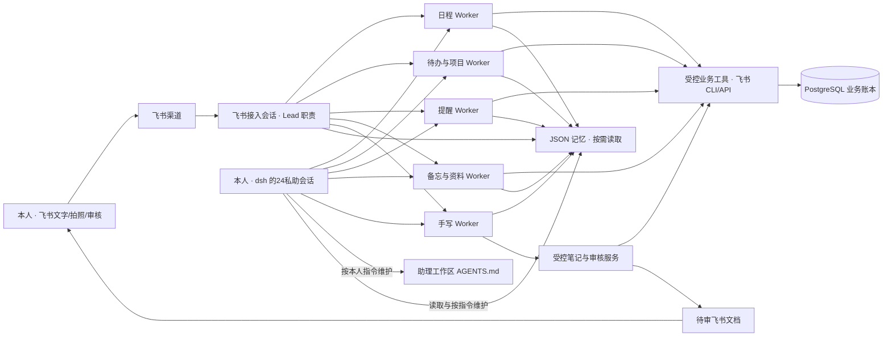

# 24私助（24PA）整体设计方案

版本：0.4。更新：2026-10-05。依据：Q1–Q6、用户确认的单一助理预设、记忆正文与 SVG/配色反馈，以及中文名「24私助」、英文名「24PA」。对应规格 1.2；正式版实施与服务器上线仍待另行授权。

## 1. 产品形态与已确认决策

24私助是服务器上一个 **dsh 工作区中的私人助理**。在飞书交办日常事务、拍照提交笔记和审核版本；在 dsh 选择唯一「24私助」预设，既能交办同类事务，也能维护配置和记忆。Lead 是内部协调职责，Worker 是专业工作角色，用户无需挑选这些角色。工作区组织共享事实，各会话保留自己的历史与回传入口。

| 主题 | 已确认选择 |
|---|---|
| 命名 | 中文「24私助」、英文「24PA」；管理入口「24私助工作区」；更名保留插件、preset、工具、会话和数据标识 |
| 日常入口 | 首版只绑定一个飞书机器人、一个主人、一个固定 CLI profile，初始使用 default；dsh 原生助理会话也可交办 |
| 工作区 | 选择服务器本地目录；AGENTS.md 定义稳定工作规则和非秘密配置，密钥只写引用 |
| 团队组织 | 飞书固定接入会话与本地助理会话承担相同协调职责；专业 Worker 按事项挂到实际父会话，可限量并发 |
| 多会话 | Lead 和各 Worker 是真实 dsh Session；从飞书按事项查看、追问、继续和停止，不再要求 A–E 当前指针切换 |
| 界面分工 | 飞书承载日常交办、照片、审核；dsh 面板只读查阅，同一个24私助会话同时交办、协调和维护 |
| 记忆 | 结构化 JSON 为权威来源，面板直接展示正文；本地24私助会话按指令维护，飞书接入与 Worker 只检索 |
| 整理触发 | 不做定期或自动记忆整理，不设置记忆后台 Worker；业务提醒、晨报仍可按本人设置主动运行 |
| 持久化 | 正式版业务账本使用现有 Docker PostgreSQL 直连；不使用 SQLite；dsh 原生非 SQLite 会话与附件沿用 |
| 手写 | 飞书 App 拍照发给机器人；实际视觉模型识别，生成待审飞书文档，审核限定具体版本，行动单独授权 |

v0.2 的 A–E 切换模型与 v0.3 的独立维护 preset 已取代。一个预设不等于一个 Session，多工作并行、正确恢复、统一身份以及正式版常规助理和手写能力均保留。术语见[术语表](../GLOSSARY.md)，会话取舍见 [ADR-0001](adr/0001-workspace-session-boundaries.md)。

这里的 Lead/Worker 是 Agent 职责和会话关系，首版使用 dsh 进程内 continuable 子 Agent，不为每种技能部署一个操作系统进程。Lead 在两次消息之间可以空闲；全天候在线由 Host、渠道和调度服务承担，不靠模型持续空转。

## 2. 私人助理的能力组成

| Worker / 角色 | 正式版必须完成的工作 |
|---|---|
| Lead | 自然语言接单、必要澄清、跨能力拆分、委派、进度查询、结果汇总；拒绝把接纳误报为完成 |
| 日程编排 | 查询忙闲、冲突检查、时间块建议、本人日程创建/修改/取消、明确授权的会议邀请、会前准备 |
| 待办与项目 | 收集、拆解目标、优先级/截止/估时、子任务、完成/延期/取消、项目下一步、出行办事清单 |
| 提醒与跟进 | 一次/周期/临期/会议提醒、等待材料检查点、稍后/暂停/取消、免打扰和频率控制 |
| 备忘与资料 | 随手记、带出处的检索、会议纪要、决策找回；配合其他 Worker 提供晨报、复盘和周回顾 |
| 手写笔记 | 原稿收集、中英混排与图示保留、忠实转写、摘要、疑点、候选行动、文档待审与修订 |
| 24私助的本地维护能力 | 同一预设内读取/编辑 AGENTS.md 并重载、JSON 记忆查询与人工发起的维护、诊断运行状态 |

一件事可以分派多个 Worker，例如“把这三页会议笔记整理好，明天提醒我审核”：Lead 建立手写与提醒事项，分别交办，用稳定事项标识关联结果。Worker 不直接接管机器人私聊，不自行创造新的授权；需要补充信息时把问题交回 Lead。

明确、信息完整的本人指令可以直接办理；日程建议由本人选择后执行；邀请他人、对外发信或派任务给别人必须有明确委托。笔记中的“明天联系客户”是候选行动，审核文字正确不等于授权发信。

飞书任务和日历是实际业务对象的权威来源。任务截止、计划时段、估时、完成状态分开；不把到点或排入日程当成完成。晨报、复盘和习惯提醒都必须具备，但用户开启后才推送。

后续新增录音能力时，新增录音 Worker 的职责、输入类型、工具和输出契约，并注册到 Lead 的能力目录。录音 Worker 可产出同一套备忘/候选行动/审核结构；不修改飞书交办方式，也不增加一套总控 Agent。当前不假装具备语音转写。

### 竞品调研带来的具体取舍

| 参考产品 | 官方能力依据 | 24PA 采用的设计 |
|---|---|---|
| OpenClaw | 自托管个人助理、飞书渠道插件，以及可控制时间和目标的主动唤醒。[个人助理](https://docs.openclaw.ai/start/openclaw)、[飞书](https://docs.openclaw.ai/channels/feishu)、[Heartbeat](https://docs.openclaw.ai/heartbeat) | 常驻渠道与 Agent 工作分开；有可行动事项才通知本人。24PA 用 dsh 实现，不增加第二套 Agent runtime |
| Motion | 按截止时间、优先级和依赖规划任务，并提示延期风险。[官方说明](https://www.usemotion.com/features/ai-task-manager) | 分开记录“截止时间”和“计划什么时候做”；先提供每日重点与容量不足提示 |
| Reclaim 2.0 | 日程变更预览、专注时间与习惯管理；当前任务以建议形式呈现。[官方说明](https://help.reclaim.ai/en/articles/14846468-reclaim-ai-2-0-overview) | 在写入日历前展示具体变更，并遵守工作时间和缓冲偏好 |
| Lindy | 会前准备、每周规划、会后跟进，以及动作前人工确认。[场景](https://www.lindy.ai/use-cases)、[动作配置](https://www.lindy.ai/academy-lessons/action-configuration) | 统一收集备忘、待办和笔记，再把建议变成有授权记录的动作 |
| Notion AI | 搜索给出处，会议摘要可回到转写片段。[搜索](https://www.notion.com/help/enterprise-search)、[会议笔记](https://www.notion.com/help/ai-meeting-notes) | 摘要和行动项可返回原稿；回答历史问题时附审核状态和来源 |
| Goodnotes | 支持部分平台上的中文、英文手写识别和搜索。[语言说明](https://support.goodnotes.com/hc/en-us/articles/7353727932047-Handwriting-Recognition-and-Search-Languages-in-Goodnotes) | 把原稿作为长期可回看的依据，识别文本作为派生内容；不据此推断纸张照片识别质量 |

24PA 的重点是飞书个人工作流程与中文手写人工审核。竞品提供能力启发，不作为飞书接口可用性、识别准确率或稳定性的证明。更完整的比较和三种识别路线见 [竞品与视觉研究](research/竞品能力与手写识别.md)。

## 3. 典型场景

正式版以下 30 个场景均有验收归属。原型实际范围见第 13 节与版本化验收记录。

| 编号 | 场景与用户输入 | 助理处理与可见结果 |
|---|---|---|
| S01 | 晨间主动：“工作日 8:30 告诉我今天最重要的事” | 日程、前三项重点、截止风险、待审核；显示同步时间，资料不足明确标记 |
| S02 | 规划：“帮我安排明天，留两小时写方案” | 读取忙闲/任务/工作偏好，给出时间块、容量与冲突；选定后写入日历 |
| S03 | 随手收集：“周五前交预算，另记一下今天讨论的想法” | 拆成有日期的任务与备忘；必要时只追问影响执行的歧义 |
| S04 | 目标拆解：“这周把项目发布准备好” | 提出可执行子任务、先后依赖、估时与里程碑；用户认可后入清单 |
| S05 | 临时插单：“下午临时加一小时会议” | 创建或提出候选时段，找出被挤占任务；给改期建议，保留原截止时间 |
| S06 | 重复事项：“每月 5 号检查账单” | 建立有时区的重复规则及对应提醒/任务；可跳过本次或停止以后 |
| S07 | 截止风险：“这个任务今天做不完” | 记录原因、估计剩余工作、建议拆分或延期；需要对外沟通时先给草稿 |
| S08 | 等待跟进：“周三还没收到材料就提醒我” | 建立等待事项与检查点；没有合法可读的回复来源时询问本人是否收到，不声称全网监测 |
| S09 | 安排会议：“明天找半小时和小王过方案” | 解析已授权联系人、忙闲与时区；确认无法确定的人/时间；按指令创建会议并回执 |
| S10 | 会前准备：“会前把上次决定和待确认问题给我” | 检索指定项目资料、上次纪要及待办；输出议程和带出处的准备卡 |
| S11 | 会后整理：“这些是刚开会的记录” | 生成纪要、决定、待确认项和行动建议；手写源进入人工审核链，再按选定动作入任务 |
| S12 | 备忘检索：“上周为什么改了这个方案” | 返回决策、时间、文档/笔记出处及审核状态；找不到依据就说明 |
| S13 | 项目推进：“发布项目还有什么没收尾” | 汇总已授权任务、等待项与资料缺口，提出下一步；能点开原对象 |
| S14 | 个人办事：“为周末出行准备检查表” | 根据已提供的行程整理证件/物品/预约清单和提醒；不自动购买或对外提交 |
| S15 | 重要日期：“证件到期前一个月提醒我” | 保存用户提供的准确日期、时区和提前量；重复提醒与升级频率由本人设定 |
| S16 | 晚间复盘：“每天 20:30 帮我收尾” | 汇总实际完成、未完成与等待事项；给次日建议，未完成任务不全部自动延期 |
| S17 | 周回顾：“周五总结这一周并看看下周” | 项目进度、反复延期、时间容量、下一周建议；回复可直接进入对应主题 |
| S18 | 并行委托：“安排明天，另外把这页笔记整理好” | Lead 拆成日程与手写事项，分别交给 Worker；各自进展与结果回到同一个机器人 |
| S19 | 查看与继续：“笔记整理到哪了”；“继续昨天的发布计划” | Lead 按事项和引用定位 Worker，会话冷恢复后补充明确任务；其他事项继续运行 |
| S20 | 手写个性化：“整理这三页，审核后再建待办” | 保存原稿、分层转写整理、提示疑点、发布待审版本；人工通过后再选择待办 |
| S21 | 调整和免打扰：“这个提醒下午再说”；本地24私助会话：“明天休假” | 飞书修改当次提醒；本地24私助会话写入有时效的 JSON 偏好。长期配置与当前业务状态分别维护 |
| S22 | 中断恢复：“刚才那件事做到哪了，继续” | 从操作账本和会话恢复状态，报告已完成/待核对/未执行；先核对再续办，避免重复写入 |

| S23 | 维护：“把这个本地目录作为我的 24PA 工作区” | 复用 dsh 工作区选择，校验 AGENTS.md、绑定固定飞书身份并创建 Lead；现有文件不会被覆盖 |
| S24 | 维护：“记住我希望会议之间留 15 分钟” | 记录结构化偏好、来源与确认状态；下次规划按需检索并说明采用了哪条偏好 |
| S25 | 维护：“整理项目 X 的记忆，列出冲突” | 会话查询 JSON，展示去重/修订依据，按本人指令提交版本化修改；不会创建后台整理计划 |
| S26 | 维护：“这个项目结束了，删除过时记忆” | 明确目标和影响，删除或过期指定条目，保留操作依据；检索结果随之变化 |
| S27 | 接入：“检查飞书接入，告诉我还缺什么” | 同一24私助会话发起只读检查；页面区分 CLI、身份、资源和机器人链路，不将进程在线当成可用 |
| S28 | 本地：“帮我整理备忘，再把同时处理数改为 3” | 同一预设内委派并维护；Worker 归属本地发起会话，结果回本地，配置在校验及安全边界后生效 |
| S29 | 查阅：“我希望看看助理记住了什么” | 打开即看到真实记忆正文与来源，支持筛选/分页/JSON；无记录、无匹配、读取失败分别显示 |
| S30 | 查阅环境变化：切深色主题、缩窄窗口、键盘操作 | 图标与颜色保持可辨识，正文可读，卡片换列，页签焦点与选中一致，不产生业务动作 |

### 一天中的连续协助

晨报计划唤醒 Lead → 日程和待办 Worker 获取真实状态及 JSON 偏好 → Lead 给出前三项重点、容量和冲突 → 你采纳时间块后写入日历。临时插单只调整受影响部分。晚间复盘依据实际完成状态给次日建议，不自动把所有未完成事项延期。

### 同时处理多件事

你说“安排明天，整理这张笔记” → Lead 建立两个事项并立即回告安排 → Worker 分别处理 → 你继续问“预算那件事怎样了” → Lead 查询该事项及对应 Worker，不切换全局聊天指针 → 每份结果带事项名称与来源。引用旧结果或卡片固定指向原事项；指代不清才澄清。

### 拍照、审核、修订

飞书拍照发送 → 保存收到的原图与页序 → Lead 委派手写 Worker → 实际视觉模型识别 → 生成待审 v1 飞书文档并回读 → 机器人发审核卡 → 本人批准 v1 或要求修改 → 修改生成 v2，v1 凭证仍是历史记录，v2 重新待审 → 本人另行选择行动并授权创建任务。

### 维护记忆

在 dsh 的24私助会话说“记住会议之间留 15 分钟” → 查询现有记忆和 revision → 写入带来源的 confirmed 偏好 → 下次日程 Worker 按需检索使用。你说“整理项目 X 的记忆”才执行整理：列出重复、矛盾和过期项，依据指令提交变更；不创建周期计划。

## 4. 工作区、配置与模型

工作区路径是服务器上的绝对目录，复用 dsh WorkspaceRegistry 与原生目录入口。一个 24PA 实例绑定一个活动工作区和一个飞书身份；切换工作区是管理操作，需要当前工作停止或完成，不能变成飞书 profile 切换。

AGENTS.md 分两部分：稳定的角色/工作规则，以及唯一一个机器可校验的 JSON 配置块。配置包括 mode、larkProfile、主人 open_id、文档目录、任务清单、日历、时区、启用的 Worker、并发数和可选模型路由。模型密钥、应用密钥、数据库连接串只存环境/凭据服务，文件保存对应引用。具体原型模板由插件生成，见体验说明。

原生 agent-instructions 负责把工作区规则带进 Agent；插件配置加载器负责校验 JSON 与执行约束。不能只让模型“读懂配置”，也不能把规则中的描述当作真实能力已安装。未知字段或缺少必要引用拒绝应用，保留有效配置并显示错误。本地24私助会话编辑后明确重载，在安全边界生效。

Lead 使用宿主默认模型；手写 Worker 可以单独设置 dsh provider/model 的视觉路由。所有路由复用 dsh LLM 服务与凭据。视觉模型必须实际接受图像且经样本验证；未配置可用视觉模型就报告缺项，不能用示例转写冒充结果。

## 5. dsh 原生组件复用

源码基线：dsh 0.2.1-alpha.1，提交 `5badb15009ae1756c3afe0ae0cef1faafc290ccc`。以下是本地核查事实；服务器安装组合仍需正式部署时核对。

| 组件 | 24PA 的使用与边界 |
|---|---|
| Cordis bundle / preset / ctx.effect | 标准插件装配、模型工具、配置和卸载；唯一「24私助」预设，按可信角色限制工具，不修改 dsh 核心 |
| WorkspaceRegistry / uiWorkspace | 注册/选择目录、恢复本地24私助会话、按实际父子关系查看 Worker |
| agent-instructions / 原生文件工具 | 读取 AGENTS.md；本地24私助会话可用 read/write/edit/glob/grep，业务 Agent 不暴露通用 Shell |
| SessionController / sessions | 创建和恢复顶层 Lead、提交消息、flush、原生日志；接纳与持久完成分别记录 |
| subagents.startContinuable / sendMessage | 创建带父子归属的 Worker、继续原子会话、汇报父 Agent；普通 Session.create 不替代 child API |
| subagents.interrupt / drain | 停止活动 turn、卸载排空；不是撤销外部动作，也不是耐久的业务取消 |
| 原生 continuation / Session 查询 | 按父子地址查看和冷恢复；父 Agent 运行时目录与完成通知不能替代 PG 工作账本 |
| Schedule | 晨报等智能任务绑定顶层 Lead 后再委派；原生 Schedule 拒绝 child Session，不向 Worker 直接挂计划 |
| dsh-schedule 公开时间函数 | 固定提醒复用 after/recurrence/时区算法，由业务 Outbox 发送；不复制私有 runtime 或重写 cron |
| LLM / 附件 | 模型路由、图像内容、原稿引用及已有附件设施；24PA 增加页序和审核快照 |
| fs 服务 | JSON 文件读取、版本条件写、原子发布；读取最新磁盘内容，避免与手工维护形成双份缓存权威 |
| storageDomain / JSONL | 保持 dsh 原生持久化；它是单 Host 缓存 KV，不提供跨表业务事务或手工文件改动同步 |
| session query 无索引模式 | 保留列表与精确历史，openAt: never 避免 SQLite I/O；不重写整个查询系统 |

子 Agent 继承 cwd 与父 preset；按 persona 和运行时工具白名单进一步分工，不能假定可给每个子 Agent 临时替换 preset。Worker 默认不再递归分派；Lead 协调，避免无边界子树。

现有 headless 一次任务后退出，不适合作为全天候入口。使用已包含会话、文件上传、Schedule 和 Web 管理的常驻 Host；默认一个活跃 Host、一个完整飞书长连接消费者。

## 6. 多工作、会话与恢复

每个 WorkItem 有稳定 ID、名称、职责、本人指令、状态、origin、parentSessionId、childSessionId、固定投递目标、结果引用和恢复代次。parentSessionId 指实际原生父会话；workspaceLeadId 另指固定飞书接入会话，不能代替本地父会话。专业 Worker 是能力类型，每项新工作建立隔离子会话，同一项修订通过 sendMessage 延续；长期背景按需检索。

状态包括 accepted、queued、running、waiting_input、waiting_review、completed、failed、stopped、needs_reconciliation。dsh turn 完成只说明模型回合结束，业务必须检查实际工具回执和产物，待审核不能标成全部完成。

协调会话默认按 queue 接收消息，明确停止或补充按 Host 能力处理。最多同时运行可配置数量 Worker，其他事项排队；查看 B 不停止 A。dsh 和飞书交办均保留实际父子关系，后台结果与重启补报返回原入口。本地维护和事务结果不自动广播到飞书，明确预约的主动提醒按委托发送。管理台 Worker 链接用于查看/诊断，业务续办经协调工具提交。

正式版先将飞书输入耐久写 PG Inbox，再 ACK。任务准入记录 requestId、原消息和固定事项目标；随后调用 dsh、flush、保存回执。child 接纳、父通知和业务完成之间都有崩溃窗口，PG 协调逐项核对，不能假设原生完成通知是耐久邮箱。

重启先恢复 Lead 与工作目录、核对每项子会话事件及 ActionOperation，再续办未完成阶段。已有外部结果只补回执；结果未知先查飞书，不能无脑重放工具。用户主动停止的事项不复活。原生子树的父链缺失或日志损坏时标需处理，不用普通会话复制相同 ID 冒充恢复。

## 7. JSON 记忆机制

**记忆权威为工作区的结构化 JSON**。AGENTS.md 放稳定规则，JSON 放个人偏好、确认的事实、项目背景、决定及其出处。短期运行状态在 PG，完整对话在 dsh；三者目的不同。无需向量数据库，也不自动把对话摘要写成长久事实。

原型位置为 `.24pa-prototype/memory.json`，含 version、revision、records。条目含 id、category、topic、content、source、status、updatedAt、updatedBy、reason。正式版另增加有效期、来源版本/指纹和撤销记录；规格定义这些约束，原型不声称已实现全套历史恢复。

- Lead 与 Worker 可按关键词、类别、主题、确认状态检索；结果有数量上限，带来源。只有必要条目进入上下文。
- 绑定工作区的本地顶层24私助会话持有受限写工具；先读 revision，put/delete 携带 expectedRevision 与本人指令依据。飞书接入与 Worker 只读；同一 preset 不等于相同权限，子 Agent 不继承维护授权。过期版本拒绝，原子替换避免半写文件。
- 你可以在本地24私助会话新增、更正、删除或发起整理。原型采用逐条版本写入；原生会话留工具回执。正式版提供修订历史和可回滚变更集。
- 手工修改 JSON 后下一次读取校验新文件；无效文件明确报错，不自动清空。并发改动校验文件版本；正式版维护入口还需限制同一工作区单写进程。
- 未审核转写、模型推断、矛盾事实是 unverified；人工审核笔记不会自动把全部内容写入记忆。只有本人明确选择并维护后成为相应记录。
- 飞书中“记住这个偏好”可由 Lead 指引到本地24私助会话；本版不增加第二个记忆编辑入口。现有记录仍可以被所有获准 Worker 使用。
- 不设置每日压缩、夜间归档、闲时自修正或自动候选积累任务。需要整理时由本人在本地24私助会话发起。

若正式版需要 PG 检索索引，索引只能由 JSON revision 派生且可重建，不能作为第二个可写权威。检索前发现 revision 不一致就重新读取/重建。

## 8. PostgreSQL 与主动工作

| 数据 | 权威存储 |
|---|---|
| 稳定规则与非秘密接入配置 | 工作区 AGENTS.md |
| 个人长期记忆 | 工作区 JSON；手工会话维护 |
| 事件去重、事项、Agent 关联、执行授权/结果、审核凭证、提醒发生实例、Outbox | PostgreSQL 独立 schema/表前缀 |
| 原生会话与 Schedule | dsh 现有非 SQLite JSONL/JSON 持久化 |
| 原稿与审核快照 | 受控文件/附件存储，PG 保存引用与内容哈希 |
| 实际任务、日历、文档 | 飞书；本地保存映射、同步水位及可核验结果 |

PostgreSQL 直接连接现有 Docker 数据库，使用受限账户、有界池和短事务；不能把容器内 localhost 当成数据库地址。正式版数据库不可用就停止接纳/写入相关业务，不静默退回内存。原型的显式 demo 是验证边界，不是生产容灾方案。

固定提醒复用原生时间计算，PG 唯一 occurrence + Outbox 负责发送，模型停用仍能发确定内容。智能晨报/复盘使用原生 Schedule 投递到顶层 Lead，Lead 委派；业务账本另外追踪完成与发送。每个规则只有一个执行归属，避免 Schedule 与业务轮询双发。

消息状态区分待发、平台接受、未知、失败、过期；不推断已读或完成。去重、限频、静默、稍后、停机补发和日程改期均按来源版本处理。内网长连接不需要新建公网回调服务；连接断线恢复和进程守护复用 SDK/服务器设施。

记忆整理不使用 Schedule；业务提醒和本人开启的周期简报继续支持自动触发。

## 9. 手写视觉、文档与人工审核

先保存飞书实际提供的字节及摘要；相机原图可能已经过平台压缩，需要时让本人发文件。正式版支持一批多页、页序、重发去重、模糊/反光/缺页反馈，再做整页/裁片识别。识别副本和原稿分开，坐标保存变换关系；简单图示保留原图与解释，不伪造精确重绘。

视觉输出分为忠实转写、整理摘要、疑点、候选行动、图示说明。人名、数字、时间、否定词和勾选状态重点复核；相对日期保留原话与解释依据。模型置信分数不当成校准准确率，未知字标待核对。

飞书文档包含状态块、摘要、正文、候选行动、疑点、转写和原稿索引。完成写入并回读后才发待审通知。卡片使用不透明动作令牌，服务端绑定主人、笔记、版本、哈希、期限与事项；手写 Worker 没有任何批准工具。

正式版保存不可变候选快照与人工凭证，在 PG 事务中提交裁决及文档状态同步意图。原型保存本次运行凭证，审核前/后回读文档；若内容变化或无法完整读取，不能批准为“最新全文已人工通过”。

文档显示“本人已审核 vN / 具体保存版本”，不宣称可编辑云文档永久已审。编辑生成新待审版本，旧批准作为历史事实保留；动态同步块若不能快照核验就阻止整稿批准。批准与选定行动分别授权、分别幂等处理；后改笔记不会自动修改已创建的任务。

## 10. 授权、运维与失败

仅允许绑定主人私聊；所有 Worker 共用固定 profile，按资源选择 user/bot 身份。执行器使用固定 argv 和 CLI JSON 回执，模型不拼任意 Shell。资料、图中文字和子 Agent 结果视为材料，不升级为本人授权。

停止事项不等于撤销已成功操作。外部请求超时或 PG 保存前崩溃进入待核对，先查实际对象再重试。权限失效明确要求重新授权；模型、视觉或飞书部分故障按能力降级，不能把进程在线当作全部就绪。

工作区、PG、会话、原稿、审核快照一起备份。恢复后先核对外部状态再恢复发送。一次只运行一个写同一工作区的 Host；完全离线告警依靠独立服务器监控。

## 11. 管理面板与阅读体验

管理入口为「24私助工作区」，顶部突出「与24私助对话」，页面按事项总览、飞书接入、结构化记忆、手写审核、工作区、运行记录组织。用同一个助理会话交办和维护；普通使用无需选择 Lead/Worker。长路径、原始 JSON、内部会话和诊断按需展开，正文、状态和主要动作保持清晰层级。

飞书接入不增加配置表单，按需查阅 CLI、固定 profile、主人/CLI 身份、令牌核验、环境凭据是否提供、资源可读性及最近收发；显示检查时间、配置来源与未重载差异。日常页面刷新读取缓存诊断，不重复请求平台。连接启动、身份核验、平台接收、资源可读/可写分别判断，秘密值不进入页面。

记忆页打开即展示实际记录的完整正文、主题/类别、来源、确认状态与更新时间；可展开修订依据、修改会话与 JSON。提供关键词筛选、清空、刷新、分页和总数/匹配数/revision，区分加载、无记录、无匹配与读取错误。查询切换和工作区切换不被旧结果覆盖。新增、更正、删除与整理继续经本地助理会话。

采用统一 SVG 图标，语义配色同时配文字与图标。原型使用蓝绿主操作、蓝色日程、紫色记忆/备忘、琥珀提醒/审核及玫红手写/异常；正式实现保留清楚的语义，不锁死色值。跟随 dsh 明暗主题，支持 390px 窄视口和面板换列，键盘页签导航有可见焦点，动画尊重 reduced-motion。查阅不启动模型或触发外部写入。细化验收见规格第 13 节与 T20。

## 12. 规格与正式版验收

[规格 1.2](24PA-v1-SPEC.md) 覆盖 118 条故事、30 个场景和 20 组测试，保留常规助理、主动提醒和手写审核，并收敛统一预设、结果回传与 UI/UX。主测试继续经过真实 dsh Loader、会话与隔离 PostgreSQL，只替换模型、外部网络和时钟边界；本地会话与面板在同一真实宿主验证。真实飞书租户与 30–50 页手写样本另行验收。

必须覆盖至少五项独立工作并行/排队、按事项查询和继续、旧回复/卡片归属、重启恢复、JSON 冲突修订、手工整理不产生自动计划、本人审核限定版本、模型断开仍能发送固定提醒。真实识别质量、复核时间和成本有数据后再定阈值，不凭演示宣称可用率。

已发布 44 张工单，43 张实施票归属 12 个功能 PR，P40 / #46 为整体发布验收。仍遵守“一 PR 一个可用功能”；本轮在既有票中补充命名、单入口和 UI/UX 验收，不改变编号、功能数量与原生依赖关系。

## 13. 原型交付边界

原型用于体验“飞书交办、内部角色协作、同一本地助理会话交办和维护”的组织方式，保存在 `prototype/24pa-dsh` 分支。已实现工作区绑定、AGENTS.md 校验、唯一助理预设、实际父会话回传、受控业务工具、JSON 记忆读写/正文展示、只读接入诊断、单页照片待审流程和 SVG/主题界面。命名修订仅更新展示文案及模板，不迁移现有会话与存储标识。

日程仅查本人日历/创建本人日程；待办仅创建/完成；备忘保存；提醒仅单次。多页笔记、完整规划/项目/同步、PG 业务恢复、完整 Schedule 周期闭环和录音 Worker 未在原型实现。配置、JSON 记忆、原稿及 dsh 日志持久；事项队列、提醒、审核令牌仍仅本次运行。

模型与飞书均需要实际配置后才能体验真实工作，不把边界夹具打包成交付模型。原型验证结果及限制见[验收记录](prototypes/24PA-原型验收记录.md)，操作步骤见[原型说明](../prototypes/24pa-dsh/README.md)。
