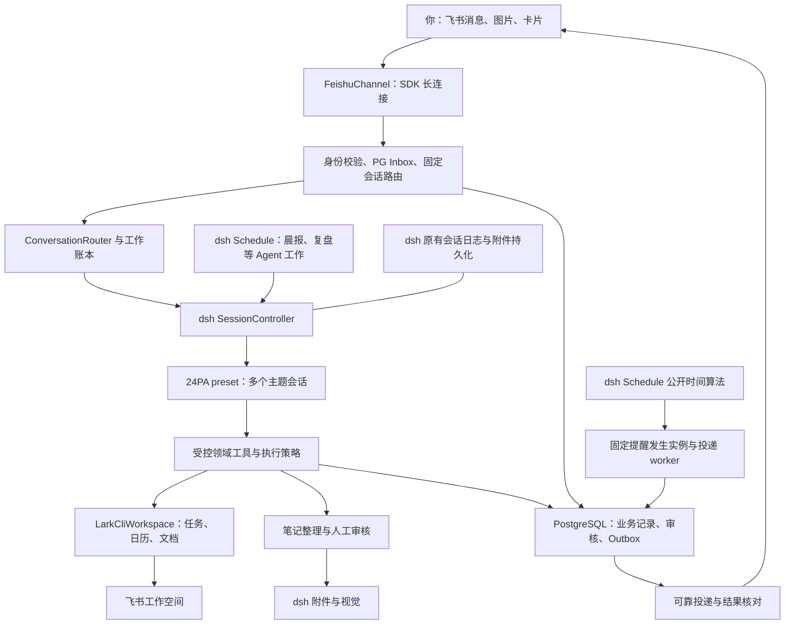
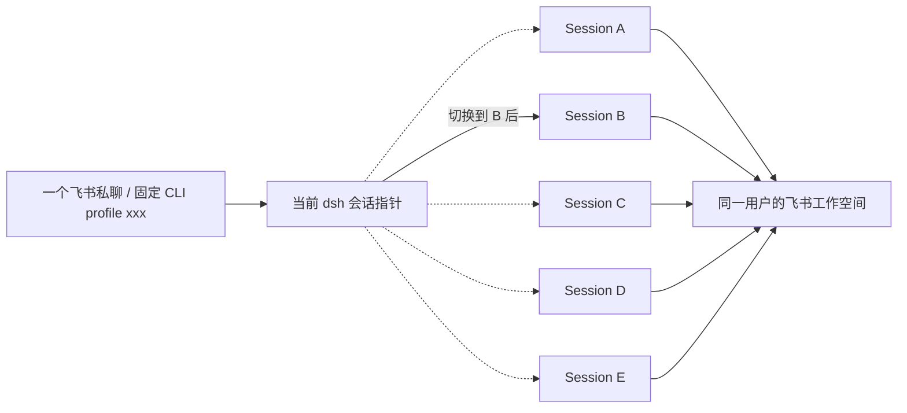
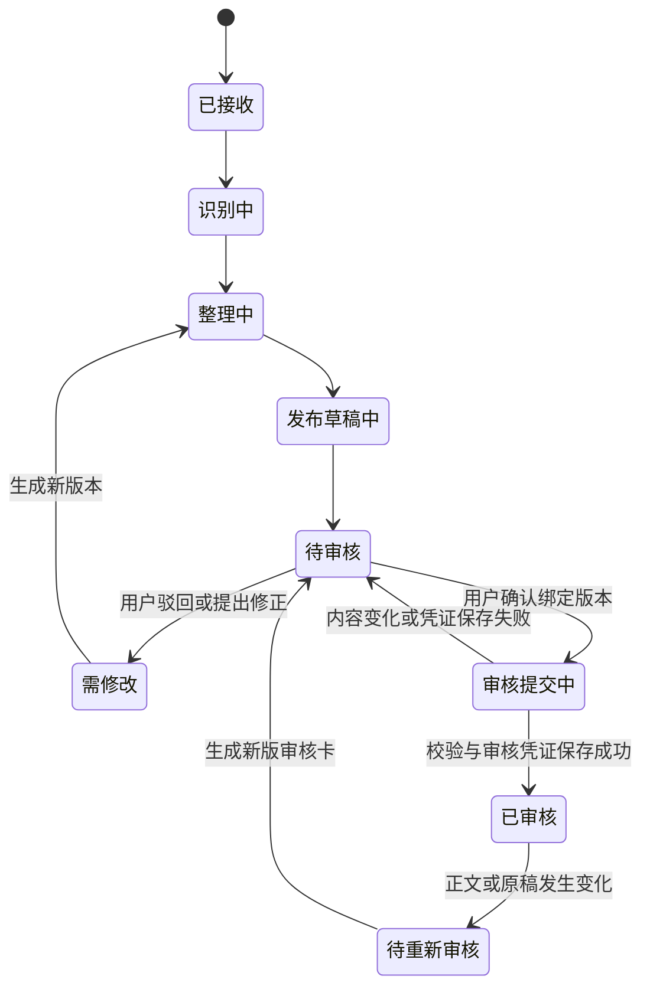

# 24PA「24小时全天候个人助理」整体设计方案

版本：0.2，第一次审核修订稿，待再次审核。更新：2026-10-05。本文是设计方案，尚未开发、部署或验证服务器环境。

已确认：部署在用户自己的 dsh 服务器；服务器通过 Docker 部署 PostgreSQL、应用直接连接，24PA 不使用 SQLite；第一版绑定飞书；常规私人助理工作必须实现，中文手写笔记整理与人工审核是重点个性化能力；方案明确批准后才开发。

## 1. 本次修订与总体建议

24PA 的产品目标是：**持续帮助你收集事项、安排时间、推动完成、找回资料，并在合适的时候主动提醒。** 它应先是一名完整的私人助理，再具备擅长处理你个人手写笔记的能力。

| 第一次审核意见 | v0.2 的调整 |
|---|---|
| 使用服务器 PostgreSQL，不用 SQLite | 业务状态、审核、会话映射、发送队列使用 PostgreSQL；dsh 原有会话日志与附件继续复用，不为换数据库重做它们。见第 6 节 |
| 常规助理工作必须实现 | 晨报、日程规划、任务拆解和跟进、会议前后工作、备忘检索、复盘、偏好均列入首版必交付；手写笔记单列个性化能力。见第 2、12 节 |
| 典型流程太少 | 扩展为 22 个场景，另展开规划、跟进、会议、多会话、手写及故障恢复的完整流程。见第 3 节 |
| 尽量复用 dsh | 逐项核实 Schedule、SessionController、sessionQuery、附件、模型、预设、工具与存储；不重写 Agent loop、会话系统或 cron/时区算法。见第 4、8 节 |
| 多会话切换和恢复 | 默认同一 dsh Host 加载 24PA；一个飞书私聊使用固定 profile 关联多个真实 dsh Session，显式切换、回复路由、原会话回执和持久恢复。见第 7 节 |

**推荐组合**：现有 dsh Host + 24PA bundle/preset + 飞书官方 SDK 长连接 + 受控的飞书 CLI + 现有 PostgreSQL。首版一个活跃 Host、一个飞书入站消费者；支持多个会话并行工作，不承诺多 Host 同时写同一会话。

用户已补充：PostgreSQL 在 Docker 中运行，应用直接连接。因此首版按 24PA 直接连接数据库设计，不假定存在 dsh PG 插件。会话范围也已确认：24PA 可有 A–E 等多个 dsh 会话，始终用同一个飞书 CLI `profile=xxx` 访问同一用户的飞书；机器人切换的是当前 dsh 会话，不实现飞书 profile 切换。

## 2. 首版能力：日常助理为主线

### 2.1 必须交付的常规工作

| 能力 | 首版应完成的工作 | 主要产物 |
|---|---|---|
| 统一收集与分流 | 接收随手想法、承诺、任务、备忘；信息足够直接入账，关键日期或对象不明确再询问 | 飞书任务、备忘文档、待澄清事项 |
| 每日规划 | 汇总日程与任务、列出今日重点、估计可用时间、提示冲突/超量、给出时间块 | 今日概览、建议计划、获授权后写入的日程 |
| 任务管理与推进 | 拆解目标、优先级、截止时间、计划时间、子任务、重复事项、完成/延期/取消 | 指定飞书任务清单；未完成与等待事项列表 |
| 日程秘书 | 查忙闲、创建/改期/取消本人日程、按明确指令安排会议、检查参会人和地点 | 飞书日历及操作回执 |
| 会议前后协助 | 会前议程与授权资料包、会议提醒；根据用户提供的记录形成纪要、决定和后续行动 | 会前卡片、会议纪要、选定的任务 |
| 备忘与知识找回 | 按主题、日期、人物、关键词整理和检索；找回决策及出处 | 约定目录下的文档、带来源的回答 |
| 主动提醒与跟进 | 定时提醒、临近截止、待办积压、等待回复、待审核、预约/续期等本人提醒 | 可完成、稍后、暂停或取消的消息/卡片 |
| 晨报、晚间复盘、周回顾 | 可开启固定时间的概览；总结完成情况、未完成原因、次日/下周建议 | 一条可操作简报；有必要时链接完整文档 |
| 持续项目与个人事务 | 按目标组织任务和资料，维护项目下一步；支持出行准备、办事、采购/续期等清单 | 主题会话、项目清单、检查表 |
| 个人偏好与记忆 | 记住用户明确告知的工作时段、缓冲、提醒习惯、常用资源；可查看、修改、删除 | 有来源的偏好记录，规划时实际遵守 |
| 多会话工作台 | 在同一飞书 profile 下列出、新建、重命名、切换、继续、归档多个 dsh Session；长工作后台运行 | A–E 等会话独立上下文、固定身份和可见工作状态 |
| 执行透明与恢复 | 回答做了什么、哪些未完成；修正/撤销可支持的动作，失败可续办 | 操作编号、对象链接、失败原因和恢复选项 |

“首版必须实现”与“默认开启”分开：晨报、复盘、习惯提醒等能力必须有，但用户开启后才周期推送；一次明确授权建立的规则内不再逐次请求确认。任务拆解、会前资料包和跟进属于私人助理的基本工作，不再放到后续版本。

飞书任务和日历是这些对象的权威来源，24PA 保存业务关联、计划建议与执行记录；不制造一套无法同步的“影子任务”。重复事项若飞书对象不支持所需规则，由 24PA 保存模板并按发生实例生成普通飞书任务，保证同一实例不重复创建；能直接复用飞书能力则优先复用。

### 2.2 个性化能力与后续范围

手写能力首版也必须交付：多页图片收集、保真原稿、中文/英文转写、简单图示保留、结构整理、疑点定位、飞书文档、指定版本人工审核、审核后行动项选择。它使用同一套任务、日历、提醒与资料系统，不形成孤立的 OCR 小工具，详见第 9 节。

首版围绕本人飞书私聊与已授权资料工作。会议录音自动转写、读取任意群聊、自动对外催办、邮件、机票/酒店购买、PDF/复杂图示、多用户及其他聊天平台作为后续扩展；会议纪要首版基于用户输入的文字、文档或手写材料。普通旅行准备、生日、续期、采购清单属于可支持的个人事项，但不会据此默认开通订票或支付。

执行原则：明确、信息完整的本人指令直接办理并回执；建议的日程变更提供具体预览；从笔记推断出的行动项供用户选定。对外发信、邀请或给他人派任务要有对应的明确指令。审核笔记内容与授权执行行动项是两个独立记录，不把“笔记通过”当成全自动执行许可。

任务、日历和用户明确保存的偏好可跨 A–E 会话使用；各会话的完整聊天历史不自动拼接共享。历史知识回答保留来源、日期和审核状态，未经审核的转写不自动变成确定事实，临时猜测也不自动写成长久偏好。需要跨会话资料时按授权引用具体记录。

### 竞品调研带来的具体取舍

| 参考产品 | 官方能力依据 | 24PA 采用的设计 |
|---|---|---|
| OpenClaw | 自托管个人助理、飞书渠道插件，以及可控制时间和目标的主动唤醒。[个人助理](https://docs.openclaw.ai/start/openclaw)、[飞书](https://docs.openclaw.ai/channels/feishu)、[Heartbeat](https://docs.openclaw.ai/heartbeat) | 常驻渠道与 Agent 工作分开；有可行动事项才通知本人。24PA 用 dsh 实现，不增加第二套 Agent runtime |
| Motion | 按截止时间、优先级和依赖规划任务，并提示延期风险。[官方说明](https://www.usemotion.com/features/ai-task-manager) | 分开记录“截止时间”和“计划什么时候做”；先提供每日重点与容量不足提示 |
| Reclaim 2.0 | 日程变更预览、专注时间与习惯管理；当前任务以建议形式呈现。[官方说明](https://help.reclaim.ai/en/articles/14846468-reclaim-ai-2-0-overview) | 在写入日历前展示具体变更，并遵守工作时间和缓冲偏好 |
| Lindy | 会前准备、每周规划、会后跟进，以及动作前人工确认。[场景](https://www.lindy.ai/use-cases)、[动作配置](https://www.lindy.ai/academy-lessons/action-configuration) | 统一收集备忘、待办和笔记，再把建议变成有授权记录的动作 |
| Notion AI | 搜索给出处，会议摘要可回到转写片段。[搜索](https://www.notion.com/help/enterprise-search)、[会议笔记](https://www.notion.com/help/ai-meeting-notes) | 摘要和行动项可返回原稿；回答历史问题时附审核状态和来源 |
| Goodnotes | 支持部分平台上的中文、英文手写识别和搜索。[语言说明](https://support.goodnotes.com/hc/en-us/articles/7353727932047-Handwriting-Recognition-and-Search-Languages-in-Goodnotes) | 把原稿作为长期可回看的依据，识别文本作为派生内容；不据此推断纸张照片识别质量 |

24PA 的重点是飞书个人工作流程与中文手写人工审核。竞品提供能力启发，不作为飞书接口可用性、识别准确率或稳定性的证明。更完整的比较和三种识别路线见 [竞品与视觉研究](research/竞品能力与手写识别.md)。

## 3. 典型场景与完整流程

下列场景均纳入首版能力与验收，具体字段和资源范围在配置时确定。例句用于说明体验，按钮/命令文案还可调整。

| 编号 | 场景与用户输入 | 助理处理与可见结果 |
|---|---|---|
| S01 | 晨间主动：“工作日 8:30 告诉我今天最重要的事” | 日程、前三项重点、截止风险、待审核；显示同步时间，资料不足明确标记 |
| S02 | 规划：“帮我安排明天，留两小时写方案” | 读取忙闲/任务/工作偏好，给出时间块、容量与冲突；选定后写入日历 |
| S03 | 随手收集：“周五前交预算，另记一下今天讨论的想法” | 拆成有日期的任务与备忘；必要时只追问影响执行的歧义 |
| S04 | 目标拆解：“这周把项目发布准备好” | 提出可执行子任务、先后依赖、估时与里程碑；用户认可后入清单 |
| S05 | 临时插单：“下午临时加一小时会议” | 创建或提出候选时段，找出被挤占任务；给改期建议，保留原截止时间 |
| S06 | 重复事项：“每月 5 号检查账单” | 建立有时区的重复规则及对应提醒/任务；可跳过本次或停止以后 |
| S07 | 截止风险：“这个任务今天做不完” | 记录原因、估计剩余工作、建议拆分或延期；需要对外沟通时先给草稿 |
| S08 | 等待跟进：“周三还没收到材料就提醒我” | 建立等待事项与检查点；没有合法可读的回复来源时询问本人是否收到，不声称全网监测 |
| S09 | 安排会议：“明天找半小时和小王过方案” | 解析已授权联系人、忙闲与时区；确认无法确定的人/时间；按指令创建会议并回执 |
| S10 | 会前准备：“会前把上次决定和待确认问题给我” | 检索指定项目资料、上次纪要及待办；输出议程和带出处的准备卡 |
| S11 | 会后整理：“这些是刚开会的记录” | 生成纪要、决定、待确认项和行动建议；手写源进入人工审核链，再按选定动作入任务 |
| S12 | 备忘检索：“上周为什么改了这个方案” | 返回决策、时间、文档/笔记出处及审核状态；找不到依据就说明 |
| S13 | 项目推进：“发布项目还有什么没收尾” | 汇总已授权任务、等待项与资料缺口，提出下一步；能点开原对象 |
| S14 | 个人办事：“为周末出行准备检查表” | 根据已提供的行程整理证件/物品/预约清单和提醒；不自动购买或对外提交 |
| S15 | 重要日期：“证件到期前一个月提醒我” | 保存用户提供的准确日期、时区和提前量；重复提醒与升级频率由本人设定 |
| S16 | 晚间复盘：“每天 20:30 帮我收尾” | 汇总实际完成、未完成与等待事项；给次日建议，未完成任务不全部自动延期 |
| S17 | 周回顾：“周五总结这一周并看看下周” | 项目进度、反复延期、时间容量、下一周建议；回复可直接进入对应主题 |
| S18 | 会话切换：“从 A 切到 B，稍后回 A” | 同一个飞书 profile；B 显示近期进展，后续普通消息进入 B；A/C/D/E 继续各自工作 |
| S19 | 查看与恢复：“看一下 B 到哪了”；“继续昨天的 C” | 单次查看 B 不改变当前 A；切换/继续 C 才改变指针，需要执行时由 dsh 冷恢复 C |
| S20 | 手写个性化：“整理这三页，审核后再建待办” | 保存原稿、分层转写整理、提示疑点、发布待审版本；人工通过后再选择待办 |
| S21 | 调整和免打扰：“明天休假；这个提醒下午再说” | 更新有时效的工作偏好/免打扰，明确哪些重要提醒仍会到达；生成一次延后实例 |
| S22 | 中断恢复：“刚才那件事做到哪了，继续” | 从操作账本和会话恢复状态，报告已完成/待核对/未执行；先核对再续办，避免重复写入 |

### 3.1 从早晨规划到晚上复盘

8:30 的 Schedule 唤醒专用简报会话 → 读取授权任务/日历 → 生成三项重点及容量缺口 → 卡片可“采纳时间块 / 调整 / 打开项目”。用户下午临时插单时重新比较剩余容量，只提交受影响部分的变更建议。晚上读取实际状态做复盘，次日建议保留每条任务原截止日期和延期原因。

“计划了两小时”不代表“任务已完成”；“到点了”也不代表“会议已参加”。任务完成来自用户动作或飞书实际状态，日历安排、截止日期与完成情况分别管理。

### 3.2 委托一件事并持续跟进

“周五交预算，周三提醒我核对材料” → 建立预算任务与材料检查点 → 周三提醒可标“材料已齐 / 继续等 / 改时间” → 周四检查剩余工作与时间容量 → 截止前提醒本人 → 用户完成后关闭跟进。对同一事项的任务提醒、项目卡片和会议资料使用同一个来源关联，合并可合并的通知。

### 3.3 会议前、中、后

安排会议并确认实际创建结果 → 会前读取授权相关资料形成议程 → 到点提醒 → 用户提供会后文字/手写材料 → 整理纪要与未决问题 → 对需要的内容完成人工审核 → 选定行动项创建任务 → 将任务链接回纪要与项目。没有会议记录来源时，不编造讨论内容或自动声称已转写录音。

### 3.4 多会话同时工作

在“发布项目”要求整理长文 → 助理返回工作编号 → 切换“出行”安排周末事项 → 旧工作完成后发送标注“发布项目”的结果卡 → 点击卡片继续原主题，普通新消息仍归“出行” → `/切换 发布项目` 才改变后续普通消息的当前主题。回复旧卡片不会让后台结果误写到当前新主题。

### 3.5 手写与人工审核

三张图组成一份笔记 → 接收编号与页序 → 转写、整理并标疑点 → 草稿和待审 V1 → 用户在草稿修订 → 生成待审 V2 与差异 → 确认 V2 → PostgreSQL 保存审核凭证 → 飞书显示“人工已审核 V2” → 用户勾选两个行动项并授权创建任务。任何后来改动都不能继承旧版的完整审核结论。

### 3.6 重启和外部写入结果未知

创建日程请求发出后网络中断 → 操作标“结果待核对” → 服务重启后先恢复业务账本和原会话 → 查询飞书或使用接口支持的幂等能力核对 → 已存在就关联回执，确实未创建才续办。没有充分证据则说明待核对，不再次盲目创建。

## 4. dsh 组件复用清单与限制

源码基线：`5badb15009ae1756c3afe0ae0cef1faafc290ccc`，本地版本 `0.2.1-alpha.1`。服务器版本与已装插件待核对。以下是源码事实与据此作出的集成选择，不能当作服务器兼容性已经实测。

| 现有组件 | 直接复用的内容 | 24PA 必须补充的领域工作 |
|---|---|---|
| Cordis / bundle / profile / `ctx.effect` | 插件装配、依赖、配置校验、启动卸载 | 一个 24PA bundle、能力 readiness、长连接与 worker 生命周期 |
| `agents` / Agent loop / preset / tools | 推理执行、模型工具、会话运行状态 | 助理 preset、窄领域工具、操作授权与资源范围，不另造 Agent runtime |
| `sessionController` | create、prompt、resolveAgent、列表/历史、取消、fork 等 | 飞书主题指针、身份绑定、按会话入队与回执路由；不重造会话引擎 |
| `sessions` / persistence / projection | 会话记录、冷恢复、状态投影和 flush 屏障 | PG 工作账本与外部结果对账；不把恢复日志误称为恢复工具进程 |
| `sessionQuery` / `session-reference` / compaction | 历史读取、引用、上下文压缩 | owner/session 过滤和明确的记忆范围；不复制全部历史进每次提示词 |
| `schedule` | 六类时间规则、IANA 时区、持久计划、原会话唤醒、恢复及投递历史 | 飞书消息 Outbox、业务完成监督；固定提醒复用公开时间算法，见第 8 节 |
| `storage` / `storageDomain` | backend 路由、schema 校验、单域串行 KV 写入 | 沿用宿主既有非 SQLite backend；24PA 跨表业务事务直接走 PG repository |
| `attachments` / fileUploads / 模型图像路由 | 原始文件/图像准入、附件引用、视觉调用 | 页序、原稿哈希、裁片映射、领域转写结构和人工审核 |
| workspace / connection / Typert Remote | 工作目录、Host 连接与已有 RPC 表面 | 同 Host 调用优先；独立网关时再适配鉴权和 owner 检查 |
| credentials / CLI 授权机制 | 已有模型凭据与 CLI 用户令牌管理 | 固定身份/profile、作用域检查、失效状态和重新授权入口 |
| jobs-local / workflow | 当前进程内可运行的工作组织 | 仅作执行辅助；跨天工作、审核和重试由 PG 记录恢复 |

`dsh-base` 本身没有完整的 Schedule + SessionController 常驻组合。优先把 24PA 安装到服务器已有、可管理会话的 Host 组合；如确需精简，才在 base 上补齐 workspace、connection、fileUploads、sessionController、session persistence、schedule 等真实依赖并验证 Loader。headless 是一次任务后退出，不能作为 24 小时常驻入口。

bundle 后层对同一插件的 `config` 是整份替换，不是深合并；安装说明必须给完整配置差异。`ctx.effect` 负责释放 SDK、数据库连接和 worker，避免重载重复消费者。dsh 某些插件失败可只告警继续运行，24PA 需自己报告功能就绪情况。

24PA preset 只暴露已定义的助理工具；从 base 继承的 Shell、任意文件读写、插件安装与动态扩展能力要检查并收窄。飞书 CLI 由 Host 服务按业务参数执行，模型无需获得 Shell。权限检查落实在工具执行入口，笔记、文档和历史会话中的文字不构成新的执行授权。

本地源码没有查到 PostgreSQL provider；用户确认的是 Docker 数据库与应用直连，本方案不把新写通用 PG provider 列为首版必需。现有 `session-query-sqlite` 名称也不等于实际使用 SQLite：base 配置为 `openAt: never`，确切历史读取和列表仍可用，SQLite 不导入、不打开，全文 search 返回禁用。首版可保留该无 SQLite I/O 模式，不为名称重写查询系统；若服务器要求连该依赖包也不能存在，再选极薄的无 SQLite query provider，而不是删掉服务使 SessionController 失效。24PA 自己的资料检索通过飞书和业务索引完成。

详细源码证据见 [存储与调度复用研究](research/第一轮审核-存储与调度复用.md)、[多会话与恢复研究](research/第一轮审核-多会话与恢复.md)、[基础插件研究](research/dsh-源码与插件机制.md)。

## 5. 总体架构与职责

| 24PA 模块 | 负责什么 | 不应承担什么 |
|---|---|---|
| `ConversationRouter` | 当前主题、消息来源路由、会话可见性、回执定位 | 重写 dsh 会话状态机 |
| `AssistantService` | 收集、规划、跟进、会议、备忘与复盘的领域编排 | 把一切工作塞进一个无限增长的聊天上下文 |
| `ExecutionPolicy` | 授权依据、资源范围、外部写入规则与操作编号 | 仅依赖模型“保证不会误操作” |
| `FeishuChannel` | 消息、卡片、资源下载和真实用户动作校验 | 持有日程或审核的权威状态 |
| `LarkCliWorkspace` | 固定 argv/API 调用、身份、响应校验、对象链接 | 让模型生成任意 Shell 字符串 |
| `NoteService` / `ReviewService` | 原稿、转写、版本、疑点、审核与派生行动 | 让 LLM 自行人工批准 |
| `ScheduleBridge` | 调用原生 Schedule 或公开 recurrence 函数，记录业务绑定 | 自写 cron、时区、DST 和另一套通用调度平台 |
| `DeliveryService` | 固定提醒与最终结果的投递、回执、重试、过期、限频 | 把 Session 入队等同飞书送达 |
| `PaRepository` / `RecoveryService` | PG 事务、工作账本、恢复对账、版本迁移 | 第二份 dsh 会话原始日志 |

先在一个插件包内清晰分模块，不急于拆微服务或引入 Redis。平台抽象同时区分“消息渠道”与“工作空间”：未来换聊天平台，仍可使用飞书文档/日历，不需要重写个人助理领域逻辑。

## 6. PostgreSQL 持久化与事务

### 6.1 保存什么，复用什么

直接连接服务器 Docker 中现有的 PostgreSQL，给 24PA 独立 schema/表前缀及最小权限账户；数据库版本、连接池、备份和凭据配置在 M0 核对。dsh 若也在 Docker 中，通过受控容器网络和服务名访问；若运行于宿主机，使用实际配置的受限地址/端口。不能假定容器内 localhost 就是 PostgreSQL，也不要求向公网暴露数据库。**不提供静默退回 SQLite 的路径**；PG 不可用时明确降级，不能先回“已收到”再把数据仅放内存。

| 数据 | 权威存放位置 |
|---|---|
| 飞书任务、日程、用户可编辑文档 | 飞书；PG 只存关联、必要投影和同步游标 |
| 主人绑定、主题目录/当前指针、消息路由 | PostgreSQL |
| 入站事件、工作阶段、执行授权、操作回执、发送队列 | PostgreSQL |
| 笔记版本、审核凭证、偏好、资料索引 | PostgreSQL；大内容用不可变对象引用 |
| dsh Session 原始记录及压缩/分支历史 | 现有 dsh session persistence；如服务器是 JSONL 就继续用 JSONL |
| 原图、裁片和大快照 | 现有 dsh 附件/受控文件存储，PG 保存对象引用与哈希；备份必须涵盖文件 |
| dsh Schedule 域 | 继续使用宿主既有非 SQLite `storageDomain` backend；本地默认是 JSON。24PA 的业务关联与完成回执仍在 PG |

“不使用 SQLite”不等于强制把附件和 dsh 日志全部塞进 PG。既有 session persistence 是专门的事件存储接口，不能仅将 storageDomain 指向 PG 就宣称会话日志也已迁移。

### 6.2 两种接口分清楚

**24PA 业务事务层**：直接用 PostgreSQL 驱动和有界连接池，实现窄的 `PaRepository`。例：批准审核时，审核凭证、版本状态、更新飞书标识的 Outbox 在同一个 PG 事务提交；路由消息时，Inbox、会话绑定和待执行工作也原子提交。避免把两次 storageDomain 写伪称为一个事务。PostgreSQL 的事务能力依据见 [官方事务文档](https://www.postgresql.org/docs/current/tutorial-transactions.html)。

**dsh 领域存储层**：原生 Schedule、workspace 等继续使用现有 `storageDomain` 与非 SQLite backend，本地出厂配置是 JSON。这些是复用组件自带的持久化，不给 24PA 新建一套 JSON 业务库。domain 启动加载后依赖进程内缓存和单域写队列；即便以后接 PG，也不会自动获得跨表事务、多实例一致缓存或数据库队列。

如果后续要求 dsh 的 Schedule 域也集中到 PG，再增加符合 `StorageBackend/KvUnit` 契约的窄适配，或复用届时已有 provider；**不作为首版前置**。切换前核对现有域的数据与其他使用者，备份、停写、迁移和核验后再切换。repository 不能旁路改写已打开的 dsh domain 缓存表，也不能覆盖现有 Schedule 记录。

### 6.3 核心记录与一致性

| 记录 | 核心字段/职责 |
|---|---|
| `OwnerBinding` / `Preference` | app、tenant、主人、允许资源、时区、工作/静默偏好及来源 |
| `SessionBinding` / `ChannelCursor` | Host/session、显示别名、preset、owner、固定飞书 profile、active/previous session、绑定版本、归档状态投影 |
| `MessageRoute` / `InboxEvent` | event/message 去重、目标 session、回复来源、接收顺序、处理阶段 |
| `WorkItem` / `RunReceipt` | 用户意图、主题、原请求、会话消息/turn、阶段、取消原因、恢复代次 |
| `ActionOperation` | 授权依据、业务参数、幂等键、外部对象 ID、成功/失败/未知与核对结果 |
| `ReminderRule` / `Occurrence` | 规则、时区、来源版本、执行归属、发生点、截止/过期政策 |
| `OutboxDelivery` | 稳定去重键、原始会话、发送目标、lease、尝试次数、结果、平台消息 ID |
| `NoteRevision` / `ReviewReceipt` | 不可变内容引用、正文/原稿哈希、人工主体、版本、决定与时间 |
| `SyncCursor` / `ResourceIndex` | 同步范围、水位、最近成功、新鲜度、可回到飞书的索引 |

关键 ID 设唯一约束；状态更新带预期版本或行锁。worker 用短事务认领到期工作，提交后再调用外部 API，完成后另开短事务保存回执。需要并发 worker 时可用 `FOR UPDATE SKIP LOCKED` 实现队列认领；不能把其跳过被锁行的查询当普通完整业务查询。[PostgreSQL SELECT](https://www.postgresql.org/docs/current/sql-select.html)

认领记录有到期 lease 与 claim 版本，回写必须匹配；数据库失联即停止继续领活。lease 可避免正常并发争抢，不能消除“远端已成功、保存回执前崩溃”的窗口，所以仍需远端幂等键和结果核对。PG 事务只覆盖本库，不覆盖飞书 API 或 dsh JSONL。

首版保持一个活跃 Host，部署单副本并加进程启动互斥；PG advisory lock 可辅助互斥，但连接失联时须停工，不能把它当无限可靠的跨网络 fencing。[PostgreSQL 锁说明](https://www.postgresql.org/docs/current/explicit-locking.html) 不因为已有 PG 就直接承诺多活；dsh domain 内存、Schedule 和 Session writer 仍有单 Host 约束。

数据库迁移有版本、备份、回滚/前滚说明；恢复旧备份后先检查业务外部状态和原始文件，不自动重放全部旧 Outbox。业务期限可配置，模型/工具没有任意 SQL 或修改人工审核账本的权限。

## 7. 多会话、切换与恢复：推荐方案

### 7.1 一个固定飞书 profile，五个真实 dsh 会话

按用户确认的场景：A、B、C、D、E 就是五个真实 dsh Session，各有自己的 `session_id`、历史和任务。它们始终通过同一个飞书 CLI `profile=xxx`、同一个用户授权操作飞书。24PA 不建立第二套虚拟会话引擎；“主题/名称”只是给真实 Session 的显示标题。

三个概念分别保存：飞书 `profile=xxx` 是固定资源访问配置；dsh 启动 profile 是宿主插件组合；`active_session_id=A/B` 是飞书私聊当前选中的 dsh 会话。**切换只更新第三项**，不登录另一个飞书账户、不更换 CLI profile、不重启 Agent。

推荐具体交互如下：

| 操作 | 机器人行为 | 是否改变当前会话 |
|---|---|---|
| `我的会话` / `/会话` | 显示 A–E，带标题、当前标记、运行/排队/待审核/空闲状态与“查看 / 切换”按钮 | 否 |
| `切换到 B` / 点击 B 的“切换” | 校验绑定，原子保存 `active_session_id=B`，回复“当前：B”，展示 B 最近进展、待办和运行状态 | 是，A → B |
| `看一下 B 的进展` / 点击“查看” | 读取 B 的状态和近期记录，卡片注明“查看 B，当前仍为 A” | 否 |
| 切换后输入 `继续把第二部分整理完` | 保存明确的 B 路由，再交给 B 的 SessionController；B 忙时排队或接受明确补充 | 当前仍为 B |
| A 在后台完成 | 发“会话 A：工作已完成”卡，带“查看 A / 切换到 A” | 否，当前仍为 B |
| `返回 A` / `返回上一个会话` | 从绑定列表或持久 previous 指针恢复当前选择 | 是 |
| 重启后 `继续` | 恢复 PG 中的当前 B，再从 dsh 记录和工作账本核对 B 的状态 | 保持 B |

新建、重命名和归档也使用真实 dsh Session 接口。A/B 可是稳定短编号或名称，同名时用卡片选择；日常不要求输入长 session ID。每个列表和回复都明确当前会话，避免用户靠记忆判断消息会发到哪里。

**默认在现有同一个 dsh Host 中加载 24PA**，Web 和飞书共用 SessionController；`owner + app + chat → active_session_id` 保存到 PG，允许访问的 A–E 分别绑定 `host_id + session_id`。切换展示用冷安全读取；需要执行时调用已有 `resolveAgent`。不另起一个进程同时打开相同 Session 目录。独立 `DSH_HOME` 仅适合确实要隔离的新实例，会隔开原有会话，已从默认推荐移除。

### 7.2 消息如何准确归属

1. 卡片动作绑定其自身的 session/work/note/version，永远不靠当前主题猜对象。
2. 显式指定主题的消息走指定主题；如果与引用回复冲突，先澄清，不静默择一。
3. 回复某条旧消息，按 `MessageRoute` 回到其原主题；回执注明主题，但不悄悄切换后续普通聊天。
4. 没有指定或引用的普通消息进入当前主题；切换命令才改变该指针。
5. 新消息一经路由，目标 session 固定保存在 PG 中；后台完成或重启后发送也使用原绑定。

同一私聊的路由/切换控制串行提交，避免切换与新消息交错；按平台可用的时间/序列检测迟到消息，不能假设网络到达必定等于发送顺序。发生跨切换的归属歧义时暂存并提示选主题，不让模型猜测。消息保存后才进入对应会话的准入队列。

按钮和明确的切换命令由确定性控制器处理；自然语言若尚未解析出目标，保存为 `routing_pending`，让后续未明确目标的输入等待该路由决定，而不是先投到旧会话再搬动。切换确认必须在 PG 指针提交后发送，不依赖 B 的模型先完成一轮对话。

### 7.3 并行、排队、打断与归档

一个主题默认顺序执行，使用 `sessionController.prompt` 的 `queue` 模式；用户明确打断时才用 `steer` 或取消。首版至少管理 A–E 五个有未完成工作的 Session，模型同时运行数量独立配置，按服务器与供应商额度设置，可允许五个同时运行或显示部分排队；长笔记使用独立处理 Session/工作对象，固定提醒走投递 worker。切换会话不取消旧工作，结果卡仍标注原主题。

模型排队与执行动作排队分开：长识别不能占住飞书提醒 worker；并发模型共用预算和 API 限流。`停止` 取消某项工作，不自动删除已创建的任务/日程；若要撤销，先识别具体外部对象和支持的变更。

归档使用 dsh Workspace 的真实 archive 接口，会同步影响 Web。存在运行工作或 active 原生 Schedule 时，默认归档会拒绝；用户明确“停止并归档”才传 stopActivity，此操作会删除该会话的 active 原生计划。先展示受影响清单，若用户要保留智能计划则不归档该会话。停止可能部分成功后失败，要回读并报告实际结果；取消归档不会自动重建已删除计划。PG/飞书层外部提醒单独决定保留或停止。已归档会话的后续模型 step 会被门禁阻止，迟到入队按竞态对账，不保证继续执行。

五个会话共用飞书资源，外部写入还要按资源协调：同一任务/日程/文档的 24PA 修改进入同一资源队列，写前读最新状态、检测预期版本，完成后使其他会话缓存失效；它只协调 24PA 自己，用户在飞书直接编辑仍需版本复查。不同资源可并发，不能为了共用 profile 把五个会话全部串成一个。重复的同一来源提醒按 `owner + source + occurrence` 等业务键合并，不因来自两个 Session 就发送两遍；凭据刷新仍由一个 CLI profile 的既有机制管理。

### 7.4 恢复的四层含义

| 恢复内容 | 技术方式与保证 |
|---|---|
| 恢复当前主题 | 从 PG 读指针与绑定，检查 owner 和会话存在性；找不到则给明确修复入口 |
| 恢复聊天上下文 | 由 dsh session persistence、projection、compaction 与 SessionController 冷恢复；不另复制完整历史 |
| 恢复已收但未完成的委托 | PG Inbox/WorkItem 与 dsh message/turn 记录对账，按阶段续办 |
| 恢复外部动作与通知 | 核对 ActionOperation/Outbox 与飞书，幂等重试或保留未知状态；不重放工具日志 |

源码表明，`resolveAgent` 对同会话并发冷启动会去重；`prompt` 的 accepted 表示已入队，必须再以 `ctx.sessions.flush` 为持久屏障。`requestId` 有去重机制，但准入路径存在异步步骤，24PA 仍需 PG 唯一键与按 session 串行准入，不能依赖它保证并发 exactly-once。

PG 与 dsh 日志之间没有单个原子事务：先保存稳定输入与目标 → 提交 prompt → flush → 保存 dsh 回执。任何一步重启，都先查日志与回执是否已有该请求，再决定补交。已提交工具结果不重新运行；请求已经部分执行时，用工作阶段和新恢复代次继续缺失工作，而不是把原用户消息从头再发一次。

还有一个重要源码限制：Agent teardown/dispose 可能清掉排队 inbox 并记录取消；冷恢复不等于续跑崩溃前的模型/工具进程。停机先停止接收、记录恢复状态、尽量排空已接纳工作；重启区分用户主动取消与停机中断。只对仍有效、已授权且可安全核对的工作自动恢复，其余给出具体续办选择。多会话、长任务与外部状态共同以账本对账，不以“会话恢复成功”冒充整件事完成。当前没有公开的 wake-only 控制方法；仅 resolveAgent 不保证自动排空恢复的旧队列，需要经过验证的新恢复控制输入或合法调度唤醒，不能重复原 prompt。

恢复展示用历史投影与 `page/inspect` 等冷读；不把 `follow` 当纯只读查询，因为当前实现会为冷会话触发激活。只有用户继续或工作确需执行时恢复活跃 Agent。

### 7.5 会话接入范围与原有工具权限

本轮核心是 24PA 自己的 A–E 会话，全部使用同一个固定飞书 profile 和助理 preset，可直接切换与继续。将来若要把并非 24PA 创建的 coding 等会话也接入，再按下列两种方式处理；不把这项扩展作为 A–E 切换的前置条件：

- **引用后继续讨论**：从本人显式授权的既有会话读摘要/指定历史，在新 24PA preset 会话继续，保留来源。适合延续资料和决策，工具范围仍是私人助理。
- **原会话继续执行**：用户显式绑定具体 session；同 Host 的 SessionController 恢复同一 ID、cwd、preset，不复制日志。接入时展示名称、来源和能力范围，检查既有工具策略及审批回传能力。

不是“知道 session ID 就可读”：owner/allowlist 限制列表、读取、引用、fork 和执行；服务器其他人的会话默认不可见。已有会话产生 turn 后，preset 通常已锁定，fork 也继承原 preset；不能宣称换个 24PA 提示词就能撤掉原 coding 会话的 Shell 权限。原会话策略或审批入口无法满足飞书使用要求时，只开放引用入口，先补适配再开放原地执行。

同一会话可能同时在 Web 与飞书收消息，由 Host 统一执行，但飞书只回传自身请求/明确订阅工作的结果；不能把服务器所有 assistant 输出自动广播到私聊。读取既有历史使用单独的显式请求。对执行期间的冲突使用现有 queue/steer，并把来源写入操作回执。

若用户将来坚持独立飞书网关进程，保留原 Host 为会话唯一 writer，经鉴权后的 Typert Remote 服务桥接；不能让网关直接写原日志。现有 SDK stdio 只有有限 initialize/prompt/shutdown 表面，不适合作为完整多会话管理通道。首版同 Host 方案依赖更少，也最利于复用 Schedule 和现有会话。

## 8. 主动工作与 Schedule 复用

### 8.1 时间交给现成组件，送达由业务确认

dsh Schedule 已支持 `after / at / every / daily / weekly / cron`、IANA 时区、重启恢复、重复计划补偿及按原 Session 投递。当前出口固定为 `resolveAgent → agent.followup → sessions.flush`，其成功表示进入会话日志，不表示模型完成或飞书已收到；没有已公开可配置的飞书 delivery provider。

| 类型 | 首版方案 | 补充的原因 |
|---|---|---|
| 晨报、复盘、周回顾、项目检查等需要推理的工作 | 完整复用 `ctx.schedule` 建计划与唤醒专用工作 Session | PG 记录业务运行窗口与完成结果；输出进入统一 Outbox |
| 明确时间的会议/截止/一次性本人提醒 | 复用 `dsh-schedule` 公开 `create*ScheduleRecord` 和 `resolveRecurringOccurrence` 等函数计算规则；PG 保存发生实例，worker 直接模板发送 | 当前 Schedule 必须经 Agent，不能独立保证模型不可用时仍投递；补的是业务消息送达，不重新实现 cron/DST |
| 重试、资源同步、到期发送扫描 | 一个有界后台 worker，按 PG 的 `next_attempt_at/due_at` 认领到期工作 | 这是业务队列执行与错误恢复；不对用户再暴露第二套通用 schedule 系统 |

公开函数从包根出口调用并固定兼容版本，不复制源代码、不调用私有 `runtime` 定时器。`ReminderRule.executor` 明确选 `agent_schedule` 或 `direct_delivery`；同一规则只能有一个执行归属，避免同一提醒经两路双发。日历事件的重复实例优先按飞书事件/实例接口获取，不拿 dsh cron 重新解释飞书的完整日历重复规则。

完整共用 dsh 的同一个 timer 有一个可选后续路径：给 Schedule 增加公共 typed delivery provider。当前源码没有这个扩展点，它需要小型上游改动和独立验证，不能假装已可配置，也不作为首版前置条件。首版维持外部插件边界。不使用 `agent/pre-step` 拦截并拒绝消息来冒充通知 hook，因为会影响 inbox 消费和混合用户消息。

### 8.2 智能主动任务如何防漏与防重

Schedule 本身保留计划与投递历史，24PA 保存 `business_schedule_id ↔ dsh_schedule_id ↔ 专用 session`。固定单一业务计划使用专用会话便于归属；卡片结果携带原规则和时间窗口。创建/修改计划是可恢复操作：PG 先记意图与专用 session、稳定业务标识，再调用 Schedule 并保存实际 ID；标题/可用公开字段携带可核对的短业务标识。若响应中断，按 session、业务标识和规则列出核对，不能仅凭自由文本相似就认定或盲目新建。

Schedule 的消息 source 当前只有 kind，不能假定附带结构化 occurrence ID；需要在兼容验证中固定计划到会话的映射，并结合公开 delivery history/持久 messageId 关联投递。多条归属不明确时不靠自由文本猜 ID。在持久投递回执尚未可见时，只作有上限的等待：Schedule 已 flush Session、但保存 delivery history 失败时，该 messageId 的回执可能永远不出现。超时进入 `delivery_unconfirmed`，暂停无归属的结果发布和外部写入，结合持久 Session、规则与 PG 工作记录核对；无法证明归属就按规则过期或请求处理，不按当前时间猜 occurrence，不无限等或盲重投。运行窗口有唯一键，模型重复被唤醒也不能重复发布简报。

原生 Schedule 的历史表示已持久化入队。24PA 另查运行是否结束、是否已产出通知；失败或进程退出后按既定过期规则恢复智能工作，不修改 Schedule 内部重试语义，也不加入无界重投。当天晨报过了有用时段就记为错过或并入下一次概览，不补一串陈旧消息。

### 8.3 发送闭环

`计划 → 待发送 → 发送中 → 飞书 API 已接受 / 待重试 / 结果未知 / 已过期 / 需人工处理`。

每次发送有稳定的内部去重键，如 `owner + source_id + source_version + occurrence + offset + channel`，飞书支持的幂等字段按其有效范围复用。API 返回成功并存下消息 ID 代表平台已接受，不等于用户已读；“已读”与“点击完成”另作记录，不从发送成功推断。

已核实的飞书发信 `uuid` 去重窗口为 1 小时，不能依赖它跨天去重。卡片更新也有时效：回调 token 当前为 30 分钟、最多两次，message_id 更新共享卡片还有 14 天及发送身份等限制；这些平台限制由适配器处理，业务提醒/审核记录的生命周期不跟随短时 token 消失。具体依据见 [飞书研究](research/飞书接入与审核机制.md)。

断网、限流及服务端临时错误按有上限的退避与抖动重试；权限失败进入重新授权；请求已发出但响应丢失时标记“结果未知”，先按消息幂等能力或服务端查询核对，不能无限盲发。不能承诺所有崩溃窗口中的外部 exactly-once，目标是可追踪的至少一次处理与尽可能不重复的用户体验。

### 8.4 同步、取消和过期

日历和任务在飞书中是权威数据；本地只保留提醒所需投影。优先使用可用的订阅/增量接口，另外做有界轮询；没有确认支持的事件不列为唯一依赖。会议重复规则、取消实例、全天事件及改期分别处理，不能只用标题当事件 ID。

同步不能把按时间范围返回的一页结果当成完整日历：已核实该模式不能分页且受返回条数限制。初次同步使用受支持的锚点分页并在全部完成后保存增量游标；游标失效重建。部分变更事件字段仍有限制，因此事件只触发刷新，不作为完整日程内容。

会议到期发送前复核最近状态；取消/改期会废弃旧版本提醒。平台故障无法复核时，按数据新鲜度策略发送带“依据上次同步记录”的提示，或提示同步异常；不能把读取失败当作会议取消。改期与发送并发仍可能出现一条旧提醒，随后用可关联的更正消息处理，并在验收中覆盖此窗口。

时间以 UTC 保存触发点，同时保存 IANA 时区和原始表达。当前用户默认 `Asia/Shanghai`；日常固定本地时间与“每隔 24 小时”分开处理。服务器重启后扫描到期记录，短延迟仍有用的提醒补发并注明；已结束会议和过期提醒转为错过记录，合并提示，不集中轰炸。

建议初始默认值均作为可调整配置：日历/任务兜底同步 5 分钟；待审文档变更兜底核对 5 分钟，执行前强制核验；会议前 10 分钟提醒；非紧急主动建议在 22:00–08:00 静默；相同待审核笔记一天最多提醒一次。用户明确设置的定时提醒按其原意处理，安静时段策略在设置回执中说明，不能暗中吞掉提醒。晨报和晚间复盘需用户开启后才建立。

飞书原生提醒与 24PA 提醒应选择主要来源，首版默认不额外创建同一事项的多套原生提醒；已有原生提醒保留并提示可能重复。用户开启某类本人提醒后，规则内发送不再逐条请求确认。

## 9. 手写笔记：重点个性化能力

### 9.1 接收与保真

一份笔记有稳定的 `note_id`，每页有 `page_id`、原始消息 ID、文件摘要和顺序。首版支持 JPEG/PNG/WebP 图片；PDF、HEIC 转换和复杂扫描件稍后扩展。多次发送归组优先靠明确批次指令，短时间窗口只作提示，避免把两次会议合并。

先下载飞书能提供的原始资源并保存其原始字节，再生成识别副本。图片消息若已被飞书压缩，只能保证保存接收到的版本；需要完整质量时建议以文件发送。用通用文件附件保存原始字节，用 image 附件保存识别图。服务自己施加文件大小、页数和解码限制，因为 dsh 的通用文件存储不自带这些准入限制。

重发同一页可提示复用已有对象，但不同批次不擅自合并笔记。模糊、反光、裁切、旋转和缺页先反馈；处理失败保留编号和已完成阶段，重试不再新建一份文档。

### 9.2 视觉识别与整理

当前本地 dsh 已支持 DeepSeek 图像路由，官方当前视觉接口也有对应支持。首选通过 dsh 已有视觉模型完成首版，保留 `VisionProvider` 替换点；中文手写专用 OCR 作为后续局部复核候选，不预设双模型全量调用。模型与网关的实际开通情况仍需开发阶段验证。

识别按以下步骤执行：

1. **页级观察**：检测方向、标题、段落、列表、表格/简单图示及可能的书写顺序。
2. **区域转写**：对密集文字和疑难区域从原图裁片；保留页码、区域坐标、原文候选。不能依赖整页缩略图读小字。
3. **结构化候选**：分别产出转写段落、待确认项、人物/日期/金额、勾选状态、图示说明和行动项候选。
4. **独立整理**：依据转写生成标题、摘要和主题结构。补充推理单独标“AI 建议”，不混入原文。
5. **规则校验**：检查漏页、空段、跨页重复、时间矛盾、疑似人名/数字歧义；无法确定的内容保留候选与原稿链接。
6. **写文档并回读**：确认正文、原稿、疑点和状态块均写入成功后，才发“请审核”卡片。

证据位置分为可靠区域、模型估计区域和页级引用。裁剪/旋转保留到原图的坐标变换；模型给出的框先校验范围，无法可靠定位时退回页级，不把近似坐标当精确文字框。识别模型与主助理模型分别配置，方便独立评测和控制费用。

“下周五”保留原话并注明解释依据；只有笔记日期与时区明确时才给出解析日期。拍照上传日期不自动等于书写日期。金额、责任人、截止时间、否定词与复选框状态属于高影响字段，即使看起来流畅也须在审核中突出展示。

模型自报的“95% 置信度”不当作准确概率。用“清晰 / 存疑 / 无法辨认”等证据状态，加可核对的局部图；图上看不清就写“原稿不清”，不填上合理猜测。简单图示保留原图并附文字说明，不默认生成看似精确的重绘图。

### 9.3 飞书文档模板

文档标题示例：`[待审核] 2026-10-05 项目讨论笔记`。标题只作方便查找的提示，正文状态块及服务端记录才说明审核事实。

建议采用“一份可编辑草稿 + 按需生成的审核版本文档”。首次整理或点击“刷新审核版本”时保存服务器内容快照，并发布对应的飞书版本文档；审核卡分别链接“查看待审 Vn”和“编辑当前草稿”。草稿持续更新，版本文档按 API 能力设置只读访问，避免用一个始终变化的链接假装展示冻结内容。权限不能构成绝对不可变保证，服务仍校验快照指纹。两类文档均显示自己的状态和相互链接。

> **人工审核：待审核**  
> 笔记编号：N-… · 内容版本：V3 · 疑点：4 项  
> 审核人：未审核 · 审核时间：—  
> 原稿：3 页 · 内容指纹：… · 最近状态校验时间：…  
> 本文含 AI 转写与整理；审核结果只覆盖明确列出的版本。

正文依次包含：整理摘要、按主题整理的正文、行动项候选、需确认的问题、逐页原样转写、原图与局部图索引、审核与修订记录。篇幅长时原图放文末或附件区，每个疑点可定位到页码与区域。

通过后显示：`人工已审核：V3；审核人：你；审核时间：…；仅覆盖该版本，后续修改需重新审核`。发现后续编辑则显示 `内容已变更，待重新审核`。状态文本由服务生成，不根据模型自述或用户手工输入的“已通过”推断批准事实。

### 9.4 审核状态机与版本一致性

技术状态另含 `failed_retryable`、`needs_reauth`、`cancelled`；识别失败与用户驳回不是同一个状态。业务状态全部落盘，等待审核不会占用一个悬挂的模型调用。

每张审核卡携带服务器签发的不透明动作 ID，服务端绑定 `owner_id + tenant + note_id + note_version + content_hash + expiry`。处理时核验飞书事件来源、真实操作用户、动作有效期及当前版本；重复点击返回原结果。模型工具不包含 `approve` 能力。

同一候选的批准/驳回用 PostgreSQL 事务和预期版本条件更新裁决，不能因两张卡片或重复事件产生互相覆盖的决定。已保存的审核凭证保留历史；再次修订或撤回以新记录表达。

审核指纹按版本化的正文规范生成，覆盖文本、结构顺序、标题、行动字段和资源内容摘要；不包含新建副本时会变化的 block ID、远端 token 或渲染时间。版本文档写入后须回读验证同一规范内容，不能只哈希模型输出。系统元数据区通过其已记录 block ID 识别，资源无法核验时禁止冒充完整已核验版本。

首版文档模板只使用已验证的文本、列表、基础表格和图片块。用户后来插入的同步块、外部表格或其他动态内容不能被文档 revision 自动冻结；遇到未支持内容要明确提示，并快照依赖或阻止整稿批准，不能静默跳过后标“全文已审核”。

**审核提交顺序**：

1. 卡片生成前读取完整草稿，形成内容快照并发布“待审 Vn”版本文档；卡片的批准对象是此快照，编辑链接另列。分页传同一 `document_revision_id`，并核对读取前后版本；所需历史读取权限不足或读取中有变更则重新取最新稳定版本，不能生成混合版本快照。
2. 点击通过后重新核验草稿与待审版本文档的正文指纹；如果用户已在飞书修改，先生成新版本与变化说明，再请求确认，不能把旧卡片套到新正文。
3. 在同一 PostgreSQL 事务中保存审核凭证、笔记版本状态与文档标识同步 Outbox；凭证含待审快照引用、原稿摘要、审核主体、时间及决定；疑点须逐项修正、删除或明确“保留原稿不清”，保留的未知项不用于自动行动。
4. 更新飞书审核说明并回读；两端不同步时显示“审核凭证已保存，文档标识同步中”，后台恢复，不假装全部完成。
5. 消费文件编辑事件并定期核对；以正文与原稿的指纹判断是否需要重新审核。24PA 自己更新的审核元数据区不计入正文指纹，排除范围只取已记录的系统 block ID，不能按标题任意排除用户正文，避免隐藏内容变化或无限触发失效。

飞书 `document_revision_id` 不在本方案中被当作已证实的严格 CAS；文档与PostgreSQL也没有跨系统事务。因此，不承诺可协作编辑文档的状态标签在每一瞬间都与正文原子同步。默认显示“审核覆盖 Vn”的精确声明，审核依据是服务器保存的具体快照；变更事件加轮询收敛显示状态，读取为当前可信知识或生成执行提案前再次核验。版本文档通过后作为归档入口，后续编辑形成新版本；历史 V3 的批准事实可以保留，但不能冒充最新草稿已通过，也不将云文档宣称为不可篡改存储。

单独保存当前正文校验结果 `matches / changed / unknown` 和时间，断线不等于未修改。审核等待可跨天，但卡片回调的更新 token 有较短寿命，不能当成业务审核凭据；持久化消息 ID，通过受支持的消息更新或新通知同步结果，后台始终拒绝失效按钮。

### 9.5 行动项执行

审核卡另有“选择待办”“生成日程建议”。每条建议携带原文出处、负责人候选、日期原文及解析值。选中并明确授权后，才创建飞书任务/日程；记录 `note_version + action_item_id → external_object_id`，再次点击返回已创建对象。

后续笔记修订若影响已创建的任务或日程，生成变更建议供处理，不静默删除或覆盖外部对象。尤其是邀请其他人、修改已有会议、分配任务给他人，需要对应的明确指令。

## 10. 飞书接入与 CLI 使用

采用企业自建应用机器人，首版仅处理绑定用户的私聊。它与只能往群里推送的自定义 webhook 机器人不是同一种接入方式。身份绑定由部署配置或一次性配对码限定，不能让“第一个发消息的人”自动成为主人。

**两种身份各司其职**：机器人身份接收事件、发送提醒和卡片；用户授权身份访问本人可见的文档、任务和日历。以飞书实际授权范围为准，机器人身份不天然等于用户身份，也不天然能读取用户全部文件。

`lark-cli` 由 Host 适配器调用，所有 A–E 会话固定使用配置的同一个 `profile=xxx`；按操作显式选择 `--as user` 或 `--as bot`，固定命令白名单，参数走独立 argv，正文走受控输入文件/标准输入，校验 JSON 结果、超时与退出码。模型只传业务参数，不提供任意 shell 字符串。CLI 未覆盖的接口才走官方 OpenAPI/SDK，由同一适配层管理，避免两个实现各自写同一业务状态。

长连接常驻优先使用官方 SDK，CLI 用于工作空间操作。理由是事件消费 CLI 存在 stdin 生命周期语义，服务器 supervisor 下不能默认当成永不退出的 daemon。已核查的官方 Node SDK 会等待 handler 完成再响应，因此采用直接 WSClient/EventDispatcher：在回调时限内校验并持久化最小 InboxEvent 后才确认接收，将耗时识别、文档整理与卡片更新放入 worker；落盘失败返回失败，不能回成功。M0 对固定安装版本回归这个行为和平台重试，不能从 SDK 源码单独推导端到端零丢失。确认“收到事件”与“业务处理成功”是两个阶段。

同一个飞书应用只运行这一套完整入站连接，不同时启动另一套 CLI 事件消费者：平台多连接按集群方式分配事件，并非向每个连接广播。文档编辑和日历变更订阅需要相应权限与订阅操作，不能只在代码里注册 handler 就认为已订阅。

实际权限分成能力包申请：私聊与消息资源、文档读写与素材、指定任务清单、指定日历读写、文档变更订阅。安装引导列出各项用途，OAuth 授权过期或撤销进入 `needs_reauth` 并提示重新授权，不无休止重试；在可用时继续使用机器人身份报告系统状态。

用户凭据由固定 CLI profile 唯一管理续期，不另写一个与 CLI 竞争轮换 refresh token 的刷新器。M0 验证服务器无交互运行、授权刷新和重启持久化；授权有效期以实际响应为准。

首版不遍历全组织聊天和文件。文档限约定目录，任务限约定清单，日历限用户选择的日历。精确 scope 名称、回调结构、限流与 CLI 版本依据见 [飞书接入研究](research/飞书接入与审核机制.md)，安装时用真实权限测试核验。

## 11. 部署、运维与数据路径

推荐在服务器已有 dsh Host 组合中加入 24PA，而不是启动另一个争用同 home 的进程。profile 只隔离配置组合，不天然隔离 sessions、attachments、storage 或 Schedule；共享同一个 Host 才能直接复用既有会话和调度服务。安装、配置变更和必要重启在方案批准后进行，先备份并确认现有运行任务的处理方式。

保持一个飞书长连接入口；重复启动的防护检查覆盖 Host、插件生命周期与 PG 互斥。采用服务器现有 supervisor 管理异常重启和停止，24PA readiness 覆盖 PG、必要插件、消息接收、CLI 用户授权、资料同步与 Outbox 滞后。单一视觉模型故障只降低识别/推理能力，固定提醒仍能工作；PG 或机器人发送不可用时如实表示相关能力暂停。

长连接通常不需要公网入站端口；OAuth、网络出口和管理入口按实际部署设置。CLI 用户令牌续期只由固定 CLI profile 管理，机器人凭据不写仓库、文档、提示词或诊断消息。未读取到的数据不会以“没有任务/没有会议”替代。

数据路径为 **飞书 → 用户服务器 → 选定视觉/文本模型服务 → 飞书文档**。dsh 已有额外 Session 原始日志上传插件，需核对服务器配置。建议关闭 24PA 的非必要额外日志外传；同 Host 下若开关是全局的，必须在安装方案中列明对既有会话的影响，不能悄悄改成全局关闭。普通任务模型输入与额外遥测分开说明。

沿用服务器 PostgreSQL 的备份机制，纳入 24PA schema、dsh Session 持久化、附件/原稿、审核快照及必要配置；保留可互相核验的对象哈希与水位。仅有数据库备份不足以恢复缺失的原图和会话文件。安排一次一致性恢复演练，恢复后先核对外部动作再打开投递。

健康指标包括入站积压、发送延迟、同步新鲜度、模型/CLI 失败、待核对操作、待审核积压与数据库/磁盘余量。异常只在需要人处理或持续恶化时通知；系统完全离线无法通过自己告警，使用服务器已有独立监控。费用按模型 token、笔记页数/裁片、重试和存储计量，有并发、批次与预算上限。

## 12. 批准后的实施计划与验收

**M0–M5 都属于首版交付，日常助理能力是交付主线。** 开发顺序先把助理基本工作贯通，再完成主动协助和手写个性化，最后整体试运行；各阶段交付可演示的完整流程。

| 阶段 | 交付内容 | 验收重点 |
|---|---|---|
| M0：组件与服务器兼容性 | 核对现有 Host 与 Docker PG 直连；固定版本；同 Host bundle、无 SQLite I/O、最小能力和权限验证 | Schedule/query/sessionController 实际依赖满足；先 PG 保存再 ACK；CLI 双身份/续期；没有改坏既有会话/调度；输出复用与缺口清单 |
| M1：基础私人助理 | Inbox/Outbox/PG 事务；主题会话；任务/日历/备忘读写；一次性及会议提醒；操作回执 | S02/S03/S05/S09/S12/S18/S19/S21/S22 基础闭环；切换不串话；按授权写入；重启与结果未知可恢复 |
| M2：持续主动协助 | 目标拆解、重复事项、截止/等待跟进、会前准备、文字会后纪要、晨晚报、周回顾、项目/个人清单、偏好 | S01/S04/S06–S08/S10/S11/S13–S17；完整用 Schedule 做智能唤醒；到期消息不依赖模型；可关闭、合并和调整 |
| M3：手写个性化与审核 | 原稿、多页、视觉转写、整理、文档模板、审核快照/凭证、重新审核、选定行动项 | S20；中文/英文/图示样本可回查；无人工动作不可批准；旧卡片失效；修改不继承旧审核；失败不重复建文档 |
| M4：跨场景可靠性 | 多会话并发、关停恢复、取消/改期、权限失效、限流、文档并发编辑、数据迁移和备份恢复 | 同一用户委托不重复产生副作用；Schedule 入队与通知成功分别可查；PG/文件/飞书三方对账清楚 |
| M5：服务器试运行与交付 | 安装包、配置/运维说明、验收记录、成本报告与剩余限制 | 连续试运行覆盖至少一次周回顾、真实任务/日历与笔记；全部 22 场景确认后交付 |

### 12.1 明确的质量约束

- 日常助理：任务截止与计划时间分开；操作有链接和实际结果；资料检索有出处；数据缺失不伪造“全部完成”。
- 多会话：运行中切换、回复旧消息、并发消息、Web/飞书同时输入、归档后提醒、重启后继续都不会串到错误主题；原有会话权限不被提示词假收窄。
- 可靠投递：健康依赖条件下，到期至飞书 API 接受的 P95 初始目标不超过 60 秒，试运行实测；接受、已读、完成分别统计，不承诺跨系统 exactly-once。
- 手写审核：所有疑点可回原稿；未授权人和模型不能批准；审核对象与内容版本一致；未知项不自动转换为确定性行动。
- 数据与复用：无 SQLite 数据文件/连接；dsh 时间算法、会话和附件直接复用；PG 事务失败不留下半个批准；旧备份恢复不重放过时写入。

手写评测先用获准提供的约 30–50 页真实样本，覆盖中英混排、日期、人名、勾选/划掉、潦草小字、简单图示、模糊/缺页；报告字符和关键字段错误、行动项误提取/漏提取、每页复核时间、处理时间与费用。先报告测量结果，再确定可接受阈值，当前不承诺虚构准确率。

重点故障注入：重复/乱序入站；PG 提交或 dsh flush 前后崩溃；优雅关停清 inbox；外部创建成功但响应丢失；工具被中断；模型停用但提醒到点；Schedule 入队后模型未完成；会议改期与发送竞争；审核过程中编辑；CLI 授权过期；多个 Host 误启动；恢复旧 PG 备份或附件缺失。

### 12.2 本次需审核的方案选择

建议确认的设计主张是：**常规助理与手写能力都在首版；PG 保存业务状态；同 Host 管理多个会话；Schedule 直接承担智能工作并提供固定提醒的时间规则；人工审核绑定版本，行动执行另有授权依据。**

Docker PG 网络/版本及服务账户、现有 dsh profile/版本、A–E 的实际 session 标识等属于兼容性输入；当前没有假定它们已验证。飞书目录、清单、日历、工作时段等可在 M0 配置，不必在本轮收齐凭据。实施清单见 [TODO](../TODO.md)。GitHub Issues 是正式事项追踪方式；后续已根据本方案形成 [规格 Issue #1](https://github.com/benz-ai-x/dsh-24-PA/issues/1)，实施工单待 to-tickets 拆分。

收到对 v0.2 的明确批准后才开始代码、依赖、飞书配置与服务器部署。

## 13. 调研依据与证据边界

- [第一次审核：存储与调度复用](research/第一轮审核-存储与调度复用.md)：PG 接口边界、Schedule 公开能力和必要的投递补充。
- [第一次审核：多会话与恢复](research/第一轮审核-多会话与恢复.md)：SessionController、冷恢复、队列、preset 和跨入口限制。
- [dsh 源码与插件机制](research/dsh-源码与插件机制.md)：插件/配置、视觉和基础存储；其中首轮设计建议已按 v0.2 更新。
- [飞书接入与审核机制](research/飞书接入与审核机制.md)：CLI/SDK 分工、身份、文档版本、卡片、主动发送与同步限制。
- [竞品能力与手写识别](research/竞品能力与手写识别.md)：官方能力依据、识别路线及评测建议。

本文中的技术结论基于本地源码及官方文档。服务器插件清单、租户权限、模型效果、完整会话恢复和端到端投递需要获批后的实测；“设计上具备恢复步骤”不表示已完成故障验证。
