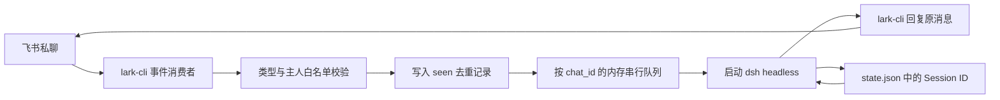

# ali_code_agent：飞书 bridge 源码分析

调研日期：2026-10-06，Asia/Shanghai。范围为用户授权只读取得的服务器源码快照、版本元数据与24私助规格 1.2。本文区分源码事实、由控制流推导的风险和建议；没有启动 bridge、调用模型、发送飞书消息或修改服务器。主人标识、凭据、私人聊天和完整原始日志不写入本文。

样例定位（2026-10-06 用户澄清）：现有 bridge 仅作参考样例，24私助必须按已确认设计完成 research 后再开发，不能直接复制其实现方式。本文保留源码观察，后续建议据此修正；执行规则见[产品基线「先 research，再开发」](../agents/product.md#先-research再开发)。

## 1. 结论

现有程序是一条简洁的「飞书私聊 → dsh headless → 飞书回复」连接链路：它使用 `lark-cli` 订阅消息，为每条消息启动一次 dsh 命令，并通过保存的 Session ID 续接同一聊天上下文。它提供白名单、同聊天串行执行、长回复分段、简短处理中提示和有限的启动补捞。这些观察用于识别接入问题和核对环境，不能据此选定产品实现。它是独立于 dsh 插件生命周期的常驻脚本，不是已完成的24私助插件。证据：M:17–35、87–108、150–187、201–252、260–300；S:6–17。

24私助沿已确认的常驻 Host、原生 Session/Worker、PostgreSQL Inbox/Outbox 与固定权限设计，先独立调研相关公开接口和运行契约，再实施。样例暴露的关键问题包括：接收状态不能保证工作恢复，图片与审核链路尚未实现，一次飞书聊天只绑定一个 dsh 会话，主动服务和角色边界尚未进入桥接层。这些问题可帮助确定研究和验证重点，不构成改造或替换该 bridge 的计划。证据与影响见下文；目标约束见 [规格](../24PA-v1-SPEC.md)「运行范围与组件所有权」「会话及外部动作的恢复」和 [ADR 0001](../adr/0001-workspace-session-boundaries.md)。

## 2. 一手证据与版本

本文的 `M:行号`、`S:行号` 均指以下服务器原文件，不是本研究文档的行号。快照字节与记录的 SHA-256 已在本地重新计算核对，均一致。

| 证据 | 服务器路径 | 行数 | SHA-256 |
|---|---|---:|---|
| M | `/root/.dsh/super-team/feishu-bridge/bridge.mjs` | 314 | `736dc3ef0e1e91587978b5bb5eb6f18b2dece7e89cb6423f66923a51b40fc406` |
| S | `/root/.dsh/super-team/feishu-bridge/bridge.sh` | 47 | `ad7f79651913d6ac2eea7d2891dcc0053c6723b66442aaae881e86696940b717` |

只读版本元数据显示服务器 dsh 包为 `@deepseek-ai/dsh 0.1.7-rc.2`，源码 HEAD 为 `477b4f420553e8a52c2fbccc464d7561b239c443`，飞书 CLI 为 `@larksuite/cli 1.0.88`，bridge 使用的 `/usr/bin/node` 返回 `v22.22.1`。规格 1.2 的源码研究基线是本地 dsh `0.2.1-alpha.1`、提交 `5badb15009ae1756c3afe0ae0cef1faafc290ccc`；二者不能当成同一个 API 版本，也不能仅凭版本不同断言不兼容。版本号本身不能证明运行进程已装载磁盘上的最新文件。来源：此次只读 `source.json` 包元数据、`runtime.json` Git 元数据与 `final-runtime-check.json` Node 版本；[规格「Further Notes」](../24PA-v1-SPEC.md#further-notes)。

快照位于仓库忽略目录 `.prototype-runtime/ali-bridge/`，不纳入版本库；源码中的主人标识未复制到本文。运行入口等采样事实见第 9 节；全部活动插件、模型权限和版本兼容性尚未完成动态验证。

## 3. 收发与会话的实际控制流

| 环节 | 已观察到的实现 | 证据 |
|---|---|---|
| 工作目录与配置 | dsh 数据目录可用 `DSH_HOME` 覆盖，Agent cwd 可用 `AGENT_CWD` 覆盖；bridge 状态目录与 dsh CLI 入口写死。默认 Agent cwd 指向现有 `dsh-super-team` 仓库。配置来自脚本常量/环境，未在桥接层加载助理 AGENTS.md 的结构化配置 | M:17–40、104–108 |
| 入站 | 启动 `lark-cli event consume im.message.receive_v1 --as bot`，以 stdout 的逐行 JSON 作为事件；保持 stdin 打开；通过 stderr 的 `[event] ready` 字符串识别就绪 | M:260–293 |
| 筛选 | 只接受 `im.message.receive_v1`、`p2p`、白名单发送者；排除 `sender_type=app`，要求消息 ID；只处理 `text` 和 `post` | M:24–27、234–252 |
| 输入传递 | `String(evt.content ?? '').trim()` 直接作为任务写入 headless stdin；没有按消息类型解析正文、提取图片或生成附件的桥接逻辑 | M:145–146、159–171 |
| 会话恢复 | 每条消息启动 `node <dshEntry> headless --json [--session-id <id>] -`。第一次从 JSON `session` 事件取 ID；运行结束后将 `chat_id → sessionId` 写回状态文件 | M:98–143、163–177 |
| 回复 | 优先取 `final` 文本，否则取最后一次 `text` 事件文本；按 3000 个 JavaScript 字符附近的换行分段，用 `im +messages-reply --message-id … --markdown … --as bot --json` 回复原消息 | M:30、62–94、121–140、179–187 |
| 落盘内容 | `state.json` 只有 `sessions` 和 `seen`；临时文件写入后 rename 发布。读失败默认为空状态；写失败仅记日志 | M:48–59 |

这里的「恢复」是向 dsh 请求恢复聊天上下文，不能据此推断未完成工具会从中断处继续、外部写入可幂等重试或结果能够补发。bridge 没有保存每项工作的阶段、输入正文、外部操作编号或发送回执。它也没有“查看 B / 切换 B / 继续 B”的确定性控制命令；输入这些文字仍然进入当前 chat 对应的同一个 Agent。证据：M:48–59、159–187、234–252。

服务器对应版本已经进一步核对：`text` 来自已提交 assistant/message 中的一个完整文本块，不能当成逐 token 增量；`final` 是该轮最终汇总文本。bridge 的兜底仅保留最后一个 text 块，因此不能在缺少 final 时把它视为完整结果。正常 JSON 输出以换行结尾，当前版本正常输出不触发 bridge 的“close 时未解析尾部半行”限制。证据：M:121–143；服务器 `/DSH/deepseek-harness/packages/bundle/headless/src/json-stream.ts:271–275`、`:318–325`，取自 `final-runtime-check.json`。

标准 headless bundle 明确为一次性任务，不挂 Web Host；bridge 通过独立子进程创建或恢复 Agent，没有调用正在运行的 web Host 的 SessionController/RPC。headless 在该轮空闲后 flush 会话，输出 final，再按 outcome 以 0 或 1 退出；即使非零退出也可能已有 final 文本。因此 bridge 仅在完全没有文本时显示失败，确实可能遗漏中断/失败状态。证据：服务器 `/DSH/deepseek-harness/packages/bundle/headless/cordis.patch.yml:1–7`、`packages/bundle/headless/src/index.ts:342–380`；M:179–184。

## 4. 队列、去重与启动补捞

### 已有机制

`chains` 用 `Map<chat_id, Promise>` 保证同一聊天中的任务按入队顺序串行，不同聊天可以并行。`seen` 最多保存最近 500 个消息 ID，跨进程重启保留；这能减少重复事件启动同一轮，但并不是工作完成账本。队列没有持久化、长度上限或排队状态回执。证据：M:31、150–156、244–252。

进程第一次发现消费者 ready 后，对 `state.sessions` 中已有的聊天读取最近一页历史，默认 10 条，反转为旧到新；筛选白名单、支持类型、未见过的 ID 和默认 30 分钟窗口后入队。`catchUp()` 不等待这些工作执行完成，它的 `replayed` 计数表示已入队。证据：M:34–35、201–231、272–278。

### 由控制流直接推导的恢复缺口

| 情形 | 可能出现的结果 | 依据与确定性 |
|---|---|---|
| `seen` 落盘后、工作完成前退出 | 未执行或未完成消息已被当作见过；重启补捞将跳过它。新会话的 ID 若尚未写回，也不会出现在已知聊天补捞列表 | M:163–177、202、214、220–228、244–252；由写入顺序可直接推导 |
| dsh 完成但飞书回复失败/进程退出 | 无持久结果或 Outbox 可补发；消息继续保留在 `seen` | M:87–94、174–187；由状态字段和调用顺序可直接推导 |
| 状态文件损坏或暂时不可读 | 被当作首次运行，既有映射和去重视图为空；之后写入可能替代原文件，造成新会话或重复处理 | M:48–59；源码明确吞掉所有读取错误 |
| 消费者断线后在同一 bridge 进程内重启 | `catchupDone` 仍为 true，不再次补捞断线窗口 | M:258、276–278、295–299；由状态生命周期可直接推导 |
| 历史超过一页、首次联系时 bridge 离线、停机超过窗口 | 分页外消息、未知聊天或超过窗口的消息不在补捞范围 | M:202–219；明确范围限制 |
| 新实时消息与补捞同时到达 | 两者都可入同一串行链，但没有统一历史水位；较新的实时消息可能排在较旧补捞消息前 | M:225、252、278；属于可发生的时序推断，未做故障实测 |
| 历史时间格式不符合预期 | 时间解析返回 null，窗口过滤不生效；不能证明仍严格限定为 30 分钟内 | M:190–195、218–219；格式依赖，实际 CLI 返回值需另核验 |

这解释了为何24私助需要 PG Inbox 保存可恢复的输入与目标，以独立状态区分接收、准入、处理中、完成和发送，而不是把当前 `seen` 数组搬到 PG 就视为恢复完成。应保留现有防重复思路，但替换状态语义；见[规格「会话及外部动作的恢复」](../24PA-v1-SPEC.md#7-会话及外部动作的恢复)。

## 5. 进度、错误与运行守护

- 一轮开始执行 12 秒后只发送一次“正在处理”提示；排队期间没有提示，也没有 Worker 阶段进度。收到最终结果后取消该计时器。证据：M:29、150–171。
- 默认任务超时为 10 分钟，届时仅向直接 dsh 子进程发送 SIGTERM；没有升级到强制终止、进程组回收或超时业务状态。如果退出前已有文本，非零退出也会直接回复该文本，用户可能看不到失败或中断说明。证据：M:28、116–119、135–143、179–184。
- 回复只检查 CLI 退出码；未解析业务 JSON、保存平台消息 ID、核对部分成功或重试。`reply()` 内失败只记日志，随后 `processOne()` 仍写入普通 `reply msg=…` 日志，因此该日志不能作为送达凭据。证据：M:87–94、186–187。
- CLI 回复与历史读取子进程没有独立超时；若其中一次一直不退出，相应回复/补捞可能一直等待，当前聊天队列也可能停在回复步骤。这是控制流风险，未观察到实际卡死。证据：M:76–94、154、186、206–207。
- 消费者退出后按 3、6、9 秒等线性增加等待，最多 30 秒后重启；ready 会重置计数。该循环只重启消费者。bridge 自身退出后，`bridge.sh` 中没有自动重启或开机恢复配置；是否另有服务器守护需运行核对。证据：M:32、274、295–299；S:10–18。
- 脚本启动/状态主要用 tmux 会话存在判断，辅助统计消费者直接子进程；它不能证明模型、飞书授权、读写能力或业务交付健康。停止时向 tmux pane PID 发 TERM，再清除 tmux 会话；bridge 的 shutdown 只显式终止消费者并退出，不排空任务或显式回收当前 dsh 子进程。证据：S:20–37；M:303–309。
- 日志为追加写入，脚本内没有轮转、保留期限或容量限制；stderr 及部分 CLI 错误会记录到日志。运行中完全离线是否另有监控，源码不能回答。证据：M:42–45、91–92、135、183、269–271；S:15、45。

## 6. 支持范围与安全边界

| 方面 | 当前源码能够证明的范围 | 对24私助的含义 |
|---|---|---|
| 文本/富文本 | 允许 `text/post`，正文直接传入模型；对结构化 content 没有独立规范化层 | CLI 的实际事件/历史正文格式要核对；不能由支持 post 推断其中图片已交给视觉模型。M:27、159–171、225–228 |
| 拍照手写 | image 类型会收到“不支持”回复；没有资源下载、哈希、页序、视觉附件或文档写入流程 | 用户最重视的手机拍照→文档→版本审核尚未由此 bridge 实现。M:24–35、248–252；M 全文件 |
| 审核卡片 | 只消费消息事件，没有卡片动作处理器与版本核验 | 不能将自然语言“已审核”当成人工批准凭证。M:234–235、260–264；M 全文件 |
| 主动通知 | 桥接层只有对已收到消息的 reply；没有 Schedule、提醒实例或主动发送 Outbox | Agent 环境可能另有工具，但本 bridge 不提供可验证的全天候提醒闭环。M:87–94、159–187；M 全文件 |
| 主人验证 | 发送者白名单、私聊、排除 app；白名单可由环境覆盖，默认主人值写在代码里 | 不是“第一个发消息的人自动绑定”；但未在 bridge 层同时核验应用、租户和已绑定工作区。M:24–27、234–246 |
| 身份/profile | CLI 调用指定 `--as bot`，没有显式 profile 参数；dsh 调用没有指定24私助 preset | 实际选用 profile 与工具权限依赖进程环境及宿主配置，不能宣称符合单一固定 profile 和专用权限要求。M:76–90、100–108、206–207、262–264 |
| 命令边界 | 收到的文本通过 stdin 传递，CLI 参数用 `spawn` 数组；桥接代码不把该文本直接拼进 shell 命令 | 这一点值得保留；它不等于 Agent 的工具执行已受限制。M:76–78、100–108、145–146 |
| 工具与数据权限 | dsh 子进程继承进程环境；bridge 不校验每个模型工具的资源范围、操作依据、版本或本地/飞书角色 | 需要由24私助执行入口施加权限，不能只依赖一段 persona。现有 dsh preset 的实际权限未在此源码快照中。M:104–108；M 全文件 |
| 错误与日志 | 白名单标识会写日志；失败可能把最多 800 字符 stderr 回给主人 | 生产版应返回可操作且脱敏的错误，诊断日志受控保留。本文没有复制这些标识或私人输出。M:179–184、238–239、311–313 |

白名单降低了陌生人的直接入口风险，但不区分主人交办与主人转发的资料内容。后续接入手写、文档、录音后，资料中的指令仍需按低信任输入处理；人工批准、对外发送和 JSON 记忆写入必须在工具入口执行已确认的边界。这里是基于当前架构和[规格「飞书身份、事件与外部操作」](../24PA-v1-SPEC.md#3-飞书身份事件与外部操作)的设计要求，不是已经观察到某次权限滥用。

## 7. 与24私助规格 1.2 的对照与后续 research 方向

| 能力 | 样例观察 | 按规格独立调研与验证的目标 |
|---|---|---|
| 飞书连接 | 样例通过 CLI 消费消息，能够提供环境线索；其运行方式不决定产品的接入方式或应用身份 | 官方 SDK 长连接与 CLI 工作空间操作的职责分工；完整消息、资源、卡片处理；SDK ACK 行为与单消费者约束 |
| dsh 续接 | 保存聊天与 Session ID 映射，通过独立 headless 子进程续接 | 常驻 Host 中的 SessionController 与原生 continuable child；按事项保留真实父会话、来源和结果目标 |
| 防重复和串行 | 有消息 ID 去重和聊天串行，缺少持久工作阶段及发送结果 | PG Inbox/工作账本/Outbox、稳定操作编号、唯一约束、恢复核对及外部结果未知状态 |
| 助理职责 | 原有 dsh 环境可能已具备日历、任务或 CLI 工具，需单独验证现有配置 | 五类 Worker、受限工具、真实外部结果、确定性提醒和原生 Schedule；不能把模型可调用 CLI 等同整套业务已交付 |
| 图片与审核 | 样例没有专用流程 | 原件保存、视觉识别、疑点标识、版本文档、卡片校验、PG 批准凭证与行动授权分离 |
| 工作区与记忆 | `AGENT_CWD` 指向现有开发工作区 | 原生工作区、AGENTS.md 校验、JSON 记忆及本地顶层会话维护权限；飞书与 Worker 仅检索 |
| 运维 | tmux 与独立脚本负责启停，bridge 内负责消费者重连 | 插件 lifecycle、单 Host/单消费者互斥、能力就绪、持久队列、优雅退出和服务器级自动恢复 |

上表的目标来自[规格](../24PA-v1-SPEC.md) Implementation Decisions 第 1、3、5–12 节及[ADR 0001](../adr/0001-workspace-session-boundaries.md)；它界定后续研究方向，不证明产品方案已验证，也不把 bridge 的局限补写成未经确认的新产品范围。

后续先按设计研究产品所需的 dsh 插件/API 兼容性、飞书官方 SDK 与 CLI 契约，再在获准的隔离环境验证关键路径；结论完备后进入对应功能实现。部署时独立明确产品的应用、固定 profile、工作区与数据归属。本文不默认复用样例机器人、接管旧会话或替换运行中的 bridge；只有后续明确选择复用同一应用时，才研究消费者交接与回滚。现有 `chat_id → sessionId` 属于样例的会话关系，不能直接当作24私助绑定。约束依据：M:23、163–177；规格第 1、5、7、11 节及 Out of Scope。

## 8. 已验证与尚未验证

本次已核对两份源码内容、行号、SHA-256、控制流和规格差距。没有使用真实消息测试收发，没有触发模型，也没有读取凭据或会话正文；对状态和日志仅提取数量、时间与运行目录，没有导出具体聊天/会话标识及完整日志。因此本文不将“已有脚本”“已有消费者进程”写成“飞书业务已全部可用”，也不把由时序推导的恢复问题描述为已发生的事故。

后续产品研究与验证以[规格「Testing Decisions」](../24PA-v1-SPEC.md#testing-decisions)为依据：使用已确认的真实 Loader/Session/PostgreSQL 边界，核对事件持久化与 ACK、重复和乱序、外部结果未知、Worker 归属与恢复、图片附件、审核版本及生命周期清理。真实平台和视觉质量仍需单独验收。样例的 `seen` 数组、历史补捞窗口和 tmux 行为仅用于理解其局限，不成为产品必须沿用或修补的机制。

## 9. 服务器运行核对补充

以下来自本次 SSH 只读采样整理的 `.prototype-runtime/ali-bridge/runtime.json` 与 `final-runtime-check.json`，不含聊天正文或凭据；只说明采样时状态。

| 核对项 | 观察结果及边界 |
|---|---|
| 运行入口 | 存在 `dsh` 与 `feishu-bridge` 两个 tmux 会话。dsh 进程在 `/DSH/deepseek-harness` 运行 `web`；bridge 进程在 `/root/.dsh/super-team/feishu-bridge` 运行 `bridge.mjs` |
| 消费者进程树 | bridge 下方是 Node CLI 包装及 `lark-cli` 子进程链；两个 Node 和两个 `lark-cli` 进程名称不能据此算成两个独立入站消费者。主 bridge 在采样时已存活约 6 天 12 小时 |
| 实际 CLI profile | 最终 CLI 进程参数明确出现 `--profile profile-ai`。因此现有 bridge 的运行态使用 `profile-ai`，不是先前为24私助选择的 `default`；桥接源码自身没有显式固定该值。这只是样例运行事实，不改变24私助已选的 `default`，也不产生必须复用该 profile 的要求 |
| 实际 Agent 工作区 | 最新启动日志记录 `/DSH/dsh-plugins/dsh-super-team`；目录存在 AGENTS.md，package.json 为 `@benz-ai-x/dsh-super-team 0.1.6-alpha.2.1`。这表明当前桥接沿用开发工作区，不能静默改为24私助工作区或收养其旧会话；本次未读取该工作区的指令正文 |
| 状态规模 | 状态文件只保存 1 个聊天、1 个 Session 映射和 48 个 seen 消息 ID；未复制具体 ID |
| 已有运行记录 | 当前日志采样统计 48 条 recv、48 条 reply；reply failed、agent timeout、state save failed 的匹配计数均为 0。最近 recv 为 `2026-10-05T03:53:02.226Z`，最近 reply 日志为 `2026-10-05T03:53:24.891Z`。这支持“程序确实处理过消息”的判断，不证明 48 条均被平台接受、被主人读到或业务完成 |
| dsh 源码状态 | HEAD 为 `477b4f420553e8a52c2fbccc464d7561b239c443`，采样时 Git 工作树无修改；这只描述 dsh 仓库，bridge 自身位于仓库外 |

服务器源码已存在公开 SessionController 的 `resolveAgent`、`list`、`prompt`，以及 Schedule 的服务注册、持久域打开和 `create` 方法；不能因为 bridge 没调用就推断服务器没有这些能力。证据为该服务器提交下 `/DSH/deepseek-harness/packages/api/session-controller/src/index.ts:219`、`:252`、`:426`，`packages/api/session-controller/src/types.ts:288–295`，以及 `/DSH/deepseek-harness/packages/schedule/schedule/src/index.ts:68`、`:126`、`:249`，由 `runtime.json.api_evidence` 保存精确匹配行。进一步确认原生 continuable child 入口存在于服务器 `/DSH/deepseek-harness/packages/subagent/subagent/src/index.ts:252–262`；它的准入回执仍不等于执行完成或消息已落到 Session 日志。证据见 `host-compatibility.json` 和 `final-runtime-check.json`。这些源码接口的存在不证明全部被当前组合启用；24私助原型的依赖、客户端和运行契约仍需隔离装配验证，不据此要求直接升级或直接安装到现用 Host。

本次目录/容器只读盘点还看到 `Super-Team-postgres`（`pgvector/pgvector:0.8.6-pg18-bookworm`）处于运行且 healthy 状态；未连接数据库、读取账户或运行 SQL。bridge 自身的映射/去重保存在 state.json，没有直接访问 PostgreSQL 的代码。这支持继续核对现有 PG 作为24私助业务存储的部署条件，不意味着可以复用其他应用的表或未经确认执行迁移。来源：首次 SSH `docker ps` 的名称、镜像与状态字段，以及 M 全文件。
